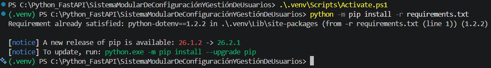
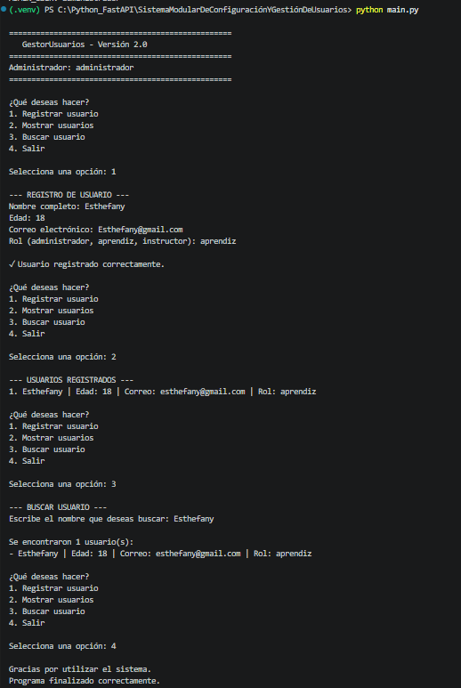
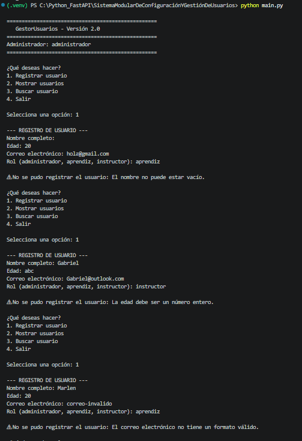
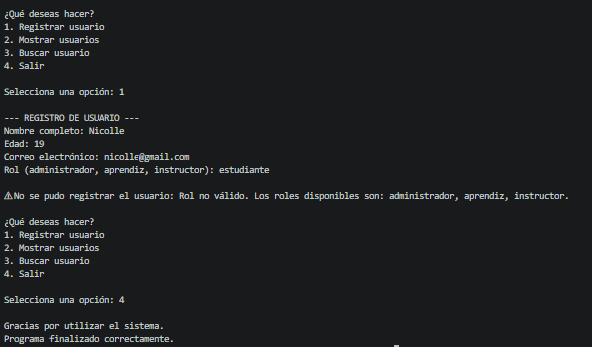
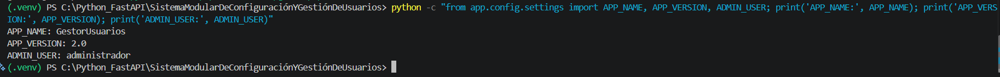

# 🐍 Sistema Modular de Configuración y Gestión de Usuarios

Repositorio correspondiente a la actividad **Clase 5 - Python avanzado: Entornos Virtuales, Gestión de Dependencias, Variables de Entorno y Modularización** del programa **Tecnología en Análisis y Desarrollo de Software (ADSO)** del **SENA**.

---

# 📖 Descripción

Este proyecto corresponde al reto integrador **Sistema Modular de Configuración y Gestión de Usuarios**, desarrollado en Python para aplicar los conceptos estudiados sobre entornos virtuales, gestión de dependencias, variables de entorno, módulos, paquetes y modularización.

A través de una aplicación de consola se implementan funcionalidades para gestionar usuarios, aplicando conceptos como:

* Entornos virtuales.
* Gestión de dependencias.
* `pip` y `requirements.txt`.
* Variables de entorno.
* `python-dotenv`.
* Módulos y paquetes.
* Importación de módulos.
* Validación de datos.
* Manejo de excepciones.
* Separación de responsabilidades.

---

# 📂 Estructura del proyecto

```text
SistemaModularDeConfiguraciónYGestiónDeUsuarios/
│
├── app/
│   ├── __init__.py
│   │
│   ├── usuarios/
│   │   ├── __init__.py
│   │   ├── gestor.py
│   │   └── validaciones.py
│   │
│   └── config/
│       ├── __init__.py
│       └── settings.py
│
├── docs/
│   └── capturas/
│       ├── Entorno-dependencias.png
│       ├── Funcionamiento.png
│       ├── Validaciones_01.png
│       ├── Validaciones_02.png
│       └── Variables-Entorno.png
│
├── .env.example
├── .gitignore
├── main.py
├── requirements.txt
└── README.md
```

---

# 📚 Contenido del proyecto

## 🟢 Gestión de usuarios

El módulo `gestor.py` contiene la clase `GestorUsuarios`, encargada de administrar las operaciones relacionadas con los usuarios.

### Funciones principales

* Registrar usuarios.
* Listar usuarios registrados.
* Buscar usuarios.
* Evitar usuarios con correos duplicados.

**Archivo**

```text
app/usuarios/gestor.py
```

---

## 🟡 Validación de datos

El módulo `validaciones.py` contiene las funciones encargadas de verificar que la información ingresada por el usuario cumpla con las condiciones establecidas.

### Validaciones implementadas

* Nombre no vacío.
* Longitud mínima del nombre.
* Nombre compuesto por letras y espacios.
* Edad válida.
* Formato correcto del correo electrónico.
* Rol válido.

Cuando los datos ingresados no cumplen las condiciones establecidas, se utilizan excepciones `ValueError` para informar el error al usuario.

**Archivo**

```text
app/usuarios/validaciones.py
```

---

## 🔵 Configuración mediante variables de entorno

El módulo `settings.py` se encarga de cargar la configuración de la aplicación utilizando la biblioteca `python-dotenv`.

Las variables utilizadas son:

```env
APP_NAME=GestorUsuarios
APP_VERSION=2.0
ADMIN_USER=administrador
```

Estas variables se almacenan en un archivo `.env`, el cual no se publica en el repositorio.

En su lugar, se incluye:

```text
.env.example
```

como plantilla para configurar el proyecto.

**Archivo**

```text
app/config/settings.py
```

---

## 🟠 Módulos y paquetes

El proyecto utiliza módulos y paquetes para dividir las responsabilidades de la aplicación.

La carpeta `app` contiene dos paquetes principales:

```text
app/
├── usuarios/
└── config/
```

El paquete `usuarios` contiene la lógica relacionada con la gestión y validación de usuarios.

El paquete `config` contiene la configuración de la aplicación y la lectura de las variables de entorno.

Los archivos `__init__.py` permiten organizar estas carpetas como paquetes de Python.

---

## 🔴 Punto de entrada – `main.py`

El archivo `main.py` es el punto de entrada de la aplicación.

Se encarga de mostrar el menú principal y permitir la interacción del usuario desde la consola.

Entre las funcionalidades disponibles se encuentran:

* Registrar usuarios.
* Listar usuarios.
* Buscar usuarios.
* Salir del sistema.

`main.py` utiliza los módulos ubicados dentro de `app` para ejecutar las diferentes funcionalidades.

---

# 🌱 Entorno virtual y dependencias

Para desarrollar el proyecto se utilizó un entorno virtual mediante **`venv`**.

El entorno virtual permite aislar las dependencias utilizadas por este proyecto de las demás instalaciones de Python del equipo.

El entorno se creó mediante:

```powershell
python -m venv .venv
```

Y se activó en Windows PowerShell utilizando:

```powershell
.\.venv\Scripts\Activate.ps1
```

Con el entorno activo se instaló la dependencia necesaria:

```powershell
pip install python-dotenv
```

Posteriormente se generó el archivo:

```text
requirements.txt
```

Este archivo permite registrar las dependencias utilizadas por el proyecto y facilita la instalación del mismo entorno en otro equipo.

Para instalar las dependencias posteriormente se utiliza:

```powershell
pip install -r requirements.txt
```

---

# 🔐 Variables de entorno

Para manejar la configuración de la aplicación se utilizó **`python-dotenv`**.

Las variables se almacenan en un archivo `.env` ubicado en la raíz del proyecto:

```text
.env
```

El archivo contiene variables como:

```env
APP_NAME=GestorUsuarios
APP_VERSION=2.0
ADMIN_USER=administrador
```

El módulo `settings.py` utiliza `load_dotenv()` para cargar estas variables y utilizarlas dentro de la aplicación.

Por seguridad, el archivo `.env` se encuentra incluido en `.gitignore` y no se publica en GitHub.

El proyecto incluye `.env.example` como referencia para crear el archivo de configuración local.

---

# 📸 Capturas de pantalla

Como parte de las evidencias de la actividad se incluyen capturas relacionadas con la configuración del entorno, instalación de dependencias, ejecución del sistema, validaciones y uso de variables de entorno.

Todas las evidencias se encuentran en:

```text
docs/capturas/
```

---

## 🖥️ Creación del entorno virtual e instalación de dependencias

La siguiente captura evidencia la creación del entorno virtual y la instalación de las dependencias necesarias para ejecutar el proyecto.



---

## ▶️ Ejecución del sistema

La siguiente evidencia muestra la ejecución del sistema desde la terminal y el funcionamiento de las opciones implementadas para la gestión de usuarios.



---

## 🔎 Validaciones

El sistema realiza diferentes validaciones sobre los datos ingresados por el usuario y utiliza excepciones para manejar los datos que no cumplen las condiciones establecidas.

### Validación 1



### Validación 2



Estas evidencias muestran el comportamiento del sistema frente a datos inválidos y los mensajes informativos que recibe el usuario.

---

## 🔐 Uso de variables de entorno

La siguiente captura evidencia el uso de las variables de entorno configuradas para la aplicación mediante `python-dotenv`.



---

# 🧩 ¿Cómo se organizó el proyecto?

El proyecto fue organizado separando las responsabilidades principales en diferentes carpetas y archivos.

La estructura se divide principalmente en:

* `main.py`: punto de entrada y menú principal.
* `app/usuarios/gestor.py`: gestión de usuarios.
* `app/usuarios/validaciones.py`: validación de los datos.
* `app/config/settings.py`: configuración y variables de entorno.
* `.env.example`: plantilla para las variables de entorno.
* `requirements.txt`: dependencias del proyecto.
* `docs/capturas/`: evidencias del desarrollo y funcionamiento.
* `README.md`: documentación del proyecto.

Esta organización evita concentrar toda la lógica en un único archivo y facilita la comprensión del sistema.

---

# 🧩 ¿Cómo funciona la modularización?

La modularización consiste en dividir una aplicación en diferentes módulos, donde cada uno tiene una responsabilidad específica.

En este proyecto, `main.py` utiliza las funcionalidades proporcionadas por los módulos de la carpeta `app`.

El flujo general es:

```text
main.py
   │
   ├── config/settings.py
   │        │
   │        └── Carga las variables de entorno
   │
   └── usuarios/gestor.py
            │
            └── Gestiona los usuarios
                     │
                     └── usuarios/validaciones.py
                              │
                              └── Valida los datos
```

De esta manera, cada módulo se encarga de una tarea concreta.

Por ejemplo, las validaciones no se encuentran directamente dentro de `main.py`, sino que están separadas en `validaciones.py`. Esto permite reutilizar y modificar las validaciones sin afectar directamente al resto de la aplicación.

---

# 📦 ¿Cómo se manejaron las dependencias y configuraciones?

Las dependencias del proyecto se gestionaron mediante `pip`.

La dependencia principal utilizada es:

```text
python-dotenv
```

Esta dependencia se registra en:

```text
requirements.txt
```

De esta manera, cualquier persona que descargue el proyecto puede instalar las dependencias mediante:

```powershell
pip install -r requirements.txt
```

La configuración se manejó mediante variables de entorno utilizando `python-dotenv`.

La información de configuración se encuentra separada del código fuente mediante el archivo `.env`, mientras que `.env.example` permite conocer qué variables deben configurarse sin exponer el archivo `.env` real.

---

# 🌱 Ventajas de utilizar entornos virtuales

Durante el desarrollo del proyecto se identificaron varias ventajas del uso de entornos virtuales:

* Permiten aislar las dependencias de cada proyecto.
* Evitan conflictos entre diferentes versiones de paquetes.
* Mantienen organizado el entorno de desarrollo.
* Permiten instalar únicamente las dependencias necesarias.
* Facilitan la reproducción del proyecto en otro equipo.
* Evitan modificar innecesariamente las instalaciones globales de Python.

En este proyecto, `venv` permitió trabajar con `python-dotenv` dentro de un entorno independiente.

---

# 💻 Ejemplo de funcionamiento

```text
========================================
     SISTEMA DE GESTIÓN DE USUARIOS
========================================

1. Registrar usuario
2. Listar usuarios
3. Buscar usuario
4. Salir

Seleccione una opción: 1

--- Registro de usuario ---

Nombre: Camila Torres
Edad: 22
Correo: camila@gmail.com
Rol: aprendiz

Usuario registrado correctamente.
```

El sistema también permite realizar búsquedas y listar los usuarios registrados.

Cuando se ingresan datos incorrectos, las validaciones muestran mensajes indicando el problema.

---

# 🛠️ Tecnologías utilizadas

| **Herramienta**       | **Uso**                         |
| --------------------- | ------------------------------- |
| 🐍 Python 3           | Desarrollo del proyecto         |
| 📦 pip                | Gestión de dependencias         |
| 🌱 venv               | Creación del entorno virtual    |
| 🔐 python-dotenv      | Gestión de variables de entorno |
| 🔧 Git                | Control de versiones            |
| 🌐 GitHub             | Repositorio remoto              |
| 💻 Visual Studio Code | Editor de código                |

---

# 🎯 Objetivo del proyecto

Aplicar los conceptos estudiados en **Python avanzado** mediante el desarrollo de un sistema modular de gestión de usuarios, fortaleciendo el uso de entornos virtuales, gestión de dependencias, variables de entorno, módulos, paquetes, validaciones y manejo de excepciones.

---

# 💡 Reflexión

Durante el desarrollo de este proyecto comprendí la importancia de organizar correctamente una aplicación desde su estructura inicial.

El uso de **entornos virtuales** permite mantener aisladas las dependencias de cada proyecto y evitar conflictos con otros proyectos de Python.

También comprendí que la **modularización** permite dividir el código según sus responsabilidades. En este caso, la gestión de usuarios, las validaciones y la configuración se encuentran separadas en diferentes módulos, haciendo que el proyecto sea más organizado, fácil de comprender y mantener.

El uso de **variables de entorno** permitió separar la configuración del código fuente, mientras que `requirements.txt` facilita la instalación de las dependencias necesarias para ejecutar el proyecto.

En conjunto, estos conceptos permiten desarrollar proyectos Python con una estructura más organizada y cercana a una metodología de desarrollo profesional.

---

# 👩‍💻 Autor

**Esthefany Valentina Chávez Parra**

**Tecnología en Análisis y Desarrollo de Software (ADSO)**

**SENA**
