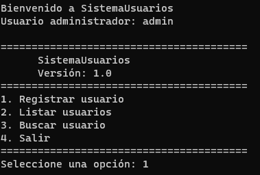
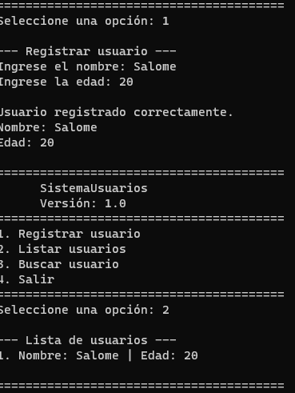
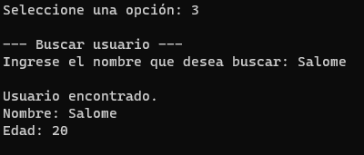
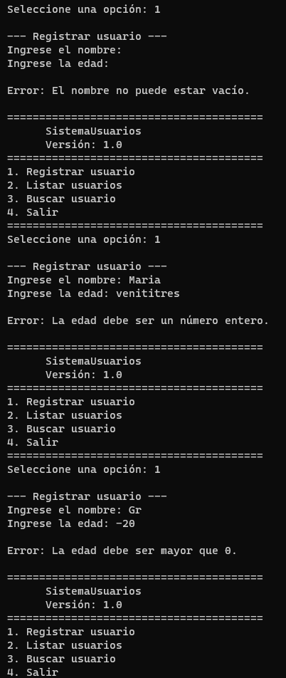

# 🧑‍💻 Sistema Modular de Configuración y Gestión de Usuarios


## 📌 Descripción del proyecto

El **Sistema Modular de Configuración y Gestión de Usuarios** es una aplicación desarrollada en Python que permite administrar usuarios desde una interfaz de consola.

Este proyecto fue desarrollado como reto integrador de la **Clase 6 - Python avanzado**, aplicando conceptos relacionados con:

- Entornos virtuales.
- Gestión de dependencias.
- Variables de entorno.
- Módulos y paquetes.
- Modularización del código.
- Validación de datos.
- Manejo de excepciones.
- Organización profesional de un proyecto Python.

El sistema permite registrar usuarios, consultar los usuarios registrados y realizar búsquedas por nombre.

La aplicación fue diseñada utilizando una separación de responsabilidades entre los diferentes módulos, permitiendo que cada parte del sistema tenga una función específica.

---

# 🎯 Objetivos

## Objetivo general

Desarrollar una aplicación modular en Python que permita gestionar usuarios desde consola, aplicando buenas prácticas de organización del código, gestión de dependencias, variables de entorno y manejo de errores.

## Objetivos específicos

- Crear y utilizar un entorno virtual mediante `venv`.
- Gestionar las dependencias mediante `pip`.
- Generar el archivo `requirements.txt`.
- Utilizar variables de entorno mediante `python-dotenv`.
- Organizar el proyecto mediante paquetes y módulos.
- Registrar usuarios desde consola.
- Listar usuarios registrados.
- Buscar usuarios por nombre.
- Validar los datos ingresados.
- Manejar errores mediante excepciones.
- Documentar el proyecto para facilitar su instalación y ejecución.

---

# ⚙️ Tecnologías utilizadas

| Tecnología | Uso |
|---|---|
| Python 3.13 | Lenguaje principal |
| venv | Creación del entorno virtual |
| pip | Gestión de dependencias |
| python-dotenv | Gestión de variables de entorno |
| Git | Control de versiones |
| GitHub | Repositorio del proyecto |
| Visual Studio Code | Entorno de desarrollo |

---

# 📂 Arquitectura del proyecto

El proyecto utiliza una estructura modular para separar las diferentes responsabilidades de la aplicación.

```text
SistemaModularDeConfiguraciónYGestiónDeUsuarios/
│
├── app/
│   ├── __init__.py
│   │
│   ├── usuarios/
│   │   ├── __init__.py
│   │   ├── gestor.py
│   │   └── validaciones.py
│   │
│   └── config/
│       ├── __init__.py
│       └── settings.py
│
├── .env
├── .env.example
├── .gitignore
├── main.py
├── README.md
└── requirements.txt

# 📸 Evidencias de funcionamiento

Las siguientes evidencias muestran las pruebas realizadas durante el desarrollo del proyecto.

## Inicio del sistema



## Registro y listado de usuarios



## Búsqueda de usuarios



## Validación de datos



## Salida del sistema

