# 🚀 API REST de Gestión de Usuarios, Dispositivos y Préstamos - device_systems

Repositorio correspondiente a la evolución de la API REST **device_systems**, desarrollada en las actividades de FastAPI Intermedio y FastAPI Avanzado del programa **Tecnología en Análisis y Desarrollo de Software (ADSO)** del **SENA**. La versión actual incorpora gestión de usuarios, dispositivos tecnológicos y préstamos, persistencia con SQLite y SQLAlchemy, migraciones con Alembic, asociaciones entre modelos, consultas con `join()`, validaciones, manejo de errores y documentación mediante Swagger/OpenAPI y ReDoc.

---

# 📖 Descripción

Este proyecto corresponde a la evolución de la API REST de usuarios desarrollada en la actividad anterior.

La aplicación **device_systems** fue ampliada utilizando **FastAPI**, incorporando persistencia real de datos mediante **SQLite y SQLAlchemy**, además de validaciones con **Pydantic**.

En esta versión se implementó el **CRUD completo** del recurso `users`, permitiendo crear, consultar, actualizar y eliminar usuarios almacenados en una base de datos real.

También se incorporaron mecanismos para el manejo de errores, códigos de estado HTTP, documentación automática mediante **Swagger/OpenAPI**, **ReDoc** y reutilización de lógica mediante **Dependency Injection con `Depends()`**.

En la nueva evolución se incorporó la gestión de **dispositivos tecnológicos** y **préstamos**, permitiendo asociar usuarios con dispositivos, validar disponibilidad, registrar devoluciones y consultar información relacionada mediante `join()`. También se implementaron **migraciones con Alembic** para versionar la estructura de la base de datos.

Los principales conceptos implementados son:

* FastAPI.
* Uvicorn.
* Pydantic v2.
* SQLAlchemy.
* SQLite.
* Métodos HTTP GET, POST, PUT, PATCH y DELETE.
* Path Parameters.
* Query Parameters.
* Validación de datos.
* Response Models.
* Manejo de errores mediante `HTTPException`.
* Códigos de estado HTTP.
* Dependency Injection con `Depends()`.
* CRUD sobre base de datos.
* Constraints de base de datos.
* Swagger UI.
* ReDoc.
* Documentación OpenAPI.
* Persistencia de datos.

---

# 🎯 Objetivo del proyecto

Transformar la API inicial de gestión de usuarios en una API REST completa para la gestión de **usuarios, dispositivos tecnológicos y préstamos**, manteniendo las operaciones CRUD, la persistencia de datos, las validaciones, el manejo de errores y la documentación automática.

La API permite:

* Crear usuarios.
* Listar usuarios.
* Consultar usuarios por ID.
* Consultar usuarios por email.
* Filtrar usuarios por rol.
* Filtrar usuarios por estado.
* Ordenar usuarios por fecha de creación.
* Actualizar completamente un usuario.
* Actualizar parcialmente un usuario.
* Eliminar usuarios bajo las reglas establecidas.
* Crear dispositivos.
* Consultar dispositivos.
* Actualizar dispositivos completa o parcialmente.
* Filtrar dispositivos por tipo, disponibilidad, marca y búsqueda textual.
* Eliminar dispositivos bajo las reglas establecidas.
* Registrar préstamos de dispositivos a usuarios.
* Validar la existencia del usuario y del dispositivo antes de prestar.
* Validar la disponibilidad del dispositivo.
* Consultar préstamos con información relacionada de usuarios y dispositivos.
* Filtrar préstamos por estado, correo, tipo de dispositivo y búsqueda textual.
* Consultar el historial de préstamos de un usuario o dispositivo.
* Registrar devoluciones y volver a marcar los dispositivos como disponibles.
* Validar los datos mediante Pydantic.
* Aplicar constraints e integridad referencial en la base de datos.
* Versionar cambios de la base de datos mediante Alembic.
* Controlar errores mediante respuestas HTTP.
* Documentar automáticamente la API con Swagger/OpenAPI y ReDoc.
* Persistir los datos en SQLite.


# 🔄 Cambios realizados respecto a la versión anterior

La versión anterior de `device_systems` trabajaba principalmente con datos almacenados en memoria.

En esta nueva versión se incorporaron cambios importantes:

* Persistencia real mediante **SQLite**.
* Integración de **SQLAlchemy** para trabajar con la base de datos.
* Creación del modelo `User`.
* Creación de la tabla `users`.
* Separación entre modelos SQLAlchemy y schemas Pydantic.
* CRUD completo sobre la base de datos.
* Validaciones mediante Pydantic.
* Constraints para proteger la integridad de los datos.
* Manejo de errores mediante `HTTPException`.
* Consulta de usuarios por email.
* Filtros por rol y estado.
* Ordenamiento por fecha de creación.
* Actualización completa mediante PUT.
* Actualización parcial mediante PATCH.
* Eliminación mediante DELETE.
* Persistencia de los usuarios incluso después de reiniciar la API.
* Documentación mediante Swagger UI y ReDoc.
* Manejo de la sesión de base de datos mediante dependencias.

De esta manera, `device_systems` pasó de manejar información temporal a utilizar una base de datos real para almacenar los usuarios.

En la siguiente evolución se agregaron nuevas funcionalidades:

* Gestión completa de dispositivos tecnológicos.
* Gestión de préstamos entre usuarios y dispositivos.
* Relaciones entre `User`, `Device` y `Loan`.
* Historial de préstamos por usuario y por dispositivo.
* Validación de disponibilidad antes de registrar un préstamo.
* Registro de devoluciones.
* Actualización automática de la disponibilidad del dispositivo al devolverlo.
* Consultas relacionadas mediante `join()`.
* Filtros avanzados para dispositivos y préstamos.
* Migraciones y versionamiento del esquema mediante Alembic.
* Nuevas dependencias específicas para dispositivos, préstamos y usuarios.
* Nuevos modelos, schemas, rutas y servicios para dispositivos y préstamos.
* Pruebas funcionales con Pytest.


---

# 📂 Estructura del proyecto

La estructura del proyecto se encuentra organizada por responsabilidades y ampliada para gestionar usuarios, dispositivos, préstamos y migraciones.

```text
device_systems/
│
├── app/
│   │
│   ├── database/
│   │   └── connection.py
│   │
│   ├── dependencies/
│   │   ├── database_dependency.py
│   │   ├── device_dependencies.py
│   │   ├── loan_dependencies.py
│   │   └── user_dependencies.py
│   │
│   ├── models/
│   │   ├── user_model.py
│   │   ├── device_model.py
│   │   └── loan_model.py
│   │
│   ├── schemas/
│   │   ├── user_schema.py
│   │   ├── device_schema.py
│   │   └── loan_schema.py
│   │
│   ├── routes/
│   │   ├── user_routes.py
│   │   ├── device_routes.py
│   │   └── loan_routes.py
│   │
│   ├── services/
│   │   ├── user_service.py
│   │   ├── device_service.py
│   │   └── loan_service.py
│   │
│   └── main.py
│
├── alembic/
│   └── alembic/
│       ├── env.py
│       └── versions/
│
├── docs/
│   └── capturas/
│
├── tests/
│   └── test_user_api.py
│
├── alembic.ini
├── device_systems.db
├── .gitignore
├── README.md
└── requirements.txt
```

### 📸 Evidencia de la estructura

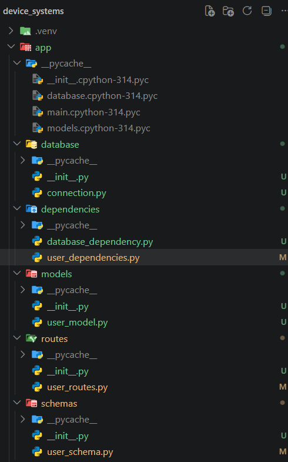

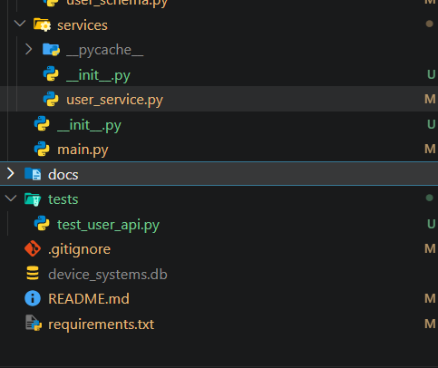

La organización permite separar la conexión a la base de datos, los modelos, schemas, rutas, servicios, dependencias y migraciones.

# 🗄️ Base de datos

La aplicación utiliza **SQLite** como sistema de base de datos.

El archivo generado es:

```text
device_systems.db
```

Dentro de la base de datos se encuentra la tabla:

```text
users
```

La información creada mediante la API se almacena de forma persistente en esta base de datos.

### 📸 Evidencia de la base de datos generada

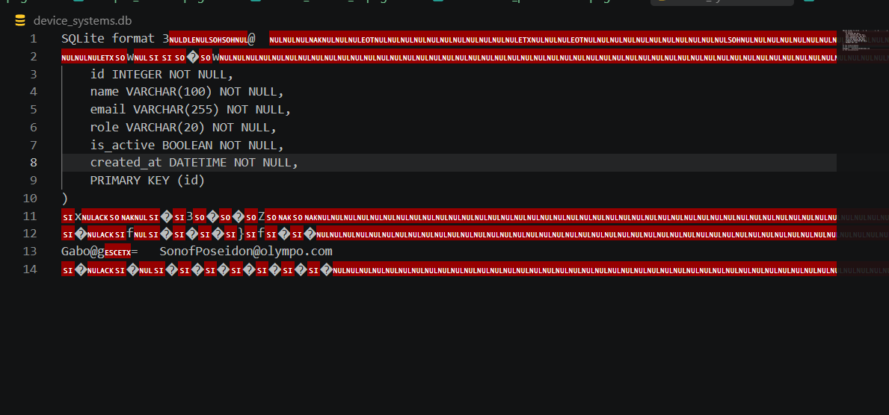

Esta evidencia muestra la base de datos generada para almacenar los usuarios del sistema.

---

# ⚙️ Configuración de SQLAlchemy

La configuración de SQLAlchemy se encuentra en:

```text
app/database/connection.py
```

Se utiliza SQLite mediante la siguiente URL:

```python
DATABASE_URL = "sqlite:///./device_systems.db"
```

Posteriormente se crea el motor de conexión:

```python
engine = create_engine(
    DATABASE_URL,
    connect_args={"check_same_thread": False},
    future=True,
)
```

También se configura la sesión que será utilizada para realizar las operaciones sobre la base de datos:

```python
SessionLocal = sessionmaker(
    autocommit=False,
    autoflush=False,
    bind=engine,
)
```

La aplicación utiliza una base declarativa para definir los modelos de SQLAlchemy.

Las tablas se crean mediante:

```python
Base.metadata.create_all(bind=engine)
```

De esta forma, SQLAlchemy permite trabajar con la base de datos desde Python y realizar las operaciones CRUD sin tener que escribir cada consulta SQL manualmente.

### 📸 Evidencia de conexión SQLite

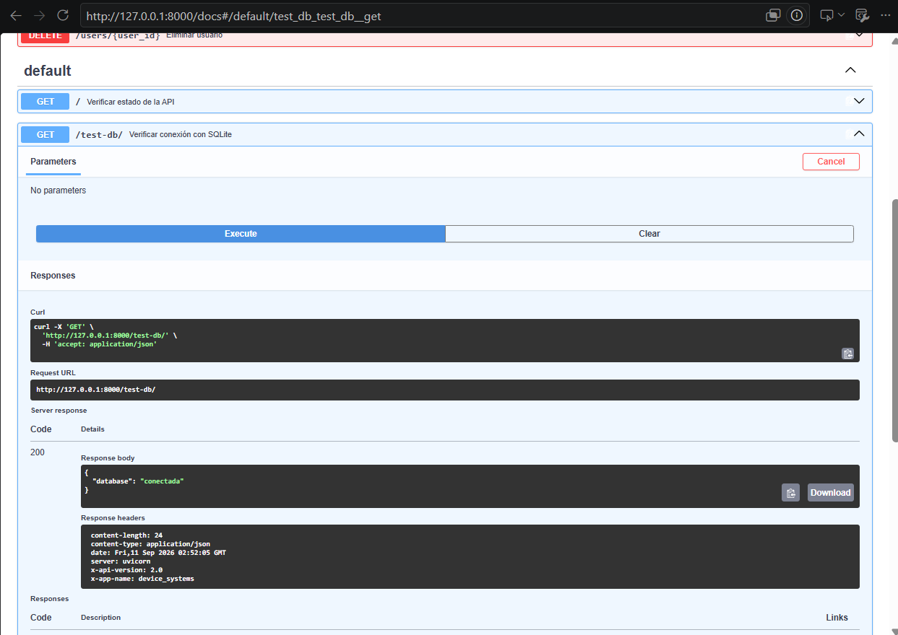

---

# 👤 Modelo User

El modelo `User` representa la tabla `users` dentro de la base de datos.

Se encuentra en:

```text
app/models/user_model.py
```

El modelo contiene los siguientes campos:

```python
class User(Base):
    __tablename__ = "users"

    id = Column(Integer, primary_key=True, index=True)
    name = Column(String(100), nullable=False)
    email = Column(String(255), unique=True, nullable=False, index=True)
    role = Column(String(20), nullable=False)
    is_active = Column(Boolean, default=True, nullable=False)
    created_at = Column(DateTime, default=datetime.utcnow, nullable=False)
```

## 🔐 Constraints aplicados

El modelo SQLAlchemy aplica diferentes restricciones:

| Campo        | Constraint / configuración          |
| ------------ | ----------------------------------- |
| `id`         | Clave primaria                      |
| `name`       | Obligatorio                         |
| `email`      | Único y obligatorio                 |
| `role`       | Obligatorio                         |
| `is_active`  | Obligatorio y con valor por defecto |
| `created_at` | Fecha de creación automática        |

El constraint `unique=True` aplicado al email evita que dos usuarios tengan el mismo correo electrónico.

---

# 🧩 Nuevos modelos y asociaciones

Además del modelo `User`, la versión actual incorpora los modelos `Device` y `Loan`.

## 💻 Modelo Device

`Device` representa los equipos tecnológicos disponibles para préstamo.

Sus principales campos son:

```text
id
name
serial_number
device_type
brand
is_available
created_at
```

El `serial_number` es único y obligatorio.

Un dispositivo puede aparecer en múltiples préstamos históricos mediante la relación:

```python
loans = relationship("Loan", back_populates="device")
```

## 📦 Modelo Loan

`Loan` representa el préstamo de un dispositivo a un usuario.

Sus principales campos son:

```text
id
user_id
device_id
loan_date
return_date
status
```

El campo `status` puede tener los valores:

```text
active
returned
overdue
```

Las claves foráneas relacionan el préstamo con `users.id` y `devices.id`.

Las relaciones inversas son:

```python
user = relationship("User", back_populates="loans")
device = relationship("Device", back_populates="loans")
```

De esta forma, un usuario puede tener múltiples préstamos y un dispositivo puede tener múltiples registros históricos de préstamo.

# 🔀 Diferencia entre modelo SQLAlchemy y schema Pydantic

Aunque ambos representan información relacionada con los usuarios, tienen funciones diferentes.

## 🔵 Modelo SQLAlchemy

El modelo SQLAlchemy representa la información que será almacenada en la base de datos.

Se encarga de:

* Representar la tabla `users`.
* Definir las columnas.
* Definir los tipos de datos.
* Aplicar constraints.
* Relacionarse con SQLite.
* Permitir guardar, consultar, modificar y eliminar registros.

Ejemplo:

```python
class User(Base):
    __tablename__ = "users"
```

---

## 🟡 Schema Pydantic

Los schemas Pydantic representan la estructura de los datos que recibe y devuelve la API.

Se utilizan principalmente para:

* Validar los datos recibidos.
* Comprobar formatos.
* Establecer restricciones.
* Definir la estructura de las peticiones.
* Definir la estructura de las respuestas.

Ejemplo:

```python
class UserCreate(BaseModel):
    name: str = Field(..., min_length=3)
    email: EmailStr
    role: Literal["admin", "support", "user"]
    is_active: bool = True
```

---

## 📌 Diferencia principal

La diferencia se puede resumir de la siguiente manera:

```text
Pydantic
   ↓
Valida los datos que recibe la API
   ↓
SQLAlchemy
   ↓
Persiste los datos en la base de datos
```

Por lo tanto:

* **Pydantic** se enfoca en validación y serialización.
* **SQLAlchemy** se enfoca en el modelo de persistencia y la interacción con la base de datos.

Ambos son complementarios, pero no cumplen la misma función.

---

# 🔵 CRUD sobre la base de datos

Las operaciones CRUD se encuentran principalmente en:

```text
app/services/user_service.py
```

CRUD significa:

```text
Create  → Crear
Read    → Consultar
Update  → Actualizar
Delete  → Eliminar
```

Las principales funciones implementadas son:

```text
get_all_users()
get_user_by_id()
get_user_by_email()
create_user()
email_exists()
update_user()
patch_user()
delete_user()
```

---

## ➕ Create

La creación de usuarios utiliza SQLAlchemy para agregar un nuevo registro:

```python
db.add(new_user)
db.commit()
db.refresh(new_user)
```

Esto permite guardar permanentemente el usuario en SQLite.

---

## 🔎 Read

La API permite consultar:

* Todos los usuarios.
* Un usuario por ID.
* Un usuario por email.
* Usuarios filtrados por rol.
* Usuarios filtrados por estado.
* Usuarios ordenados por fecha de creación.

---

## ✏️ Update

La API implementa dos tipos de actualización:

### PUT

Actualiza completamente un usuario.

```text
PUT /users/{user_id}
```

### PATCH

Actualiza parcialmente un usuario.

```text
PATCH /users/{user_id}
```

PATCH permite modificar solamente los campos enviados, manteniendo intactos los demás.

### 📸 Evidencia de campos intactos

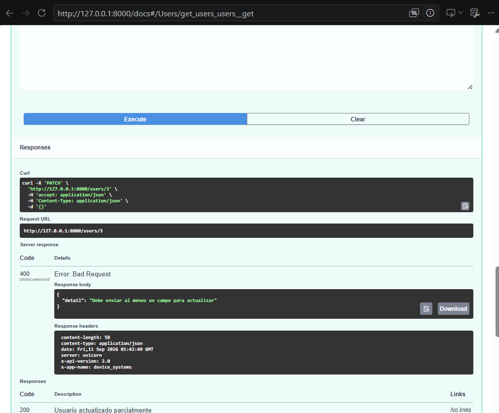

---

## 🗑️ Delete

El método DELETE elimina un usuario de la base de datos:

```text
DELETE /users/{user_id}
```

La operación utiliza SQLAlchemy para eliminar el registro y posteriormente confirmar el cambio mediante `commit()`.

---

# 🟡 Validaciones y constraints

La API utiliza Pydantic para validar los datos antes de realizar las operaciones sobre la base de datos.

Ejemplo:

```python
class UserCreate(BaseModel):
    name: str = Field(..., min_length=3)
    email: EmailStr
    role: Literal["admin", "support", "user"]
    is_active: bool = True
```

## Validaciones implementadas

* El nombre es obligatorio.
* El nombre debe tener mínimo 3 caracteres.
* El email debe tener un formato válido.
* El rol solamente puede ser `admin`, `support` o `user`.
* `is_active` debe ser booleano.
* Las actualizaciones parciales utilizan un schema específico.
* Los datos deben cumplir las reglas antes de almacenarse.

## Constraints de la base de datos

SQLAlchemy también aplica restricciones para mantener la integridad de los datos.

Entre ellas:

* Clave primaria para `id`.
* `nullable=False` para campos obligatorios.
* `unique=True` para el email.
* Valor por defecto para `is_active`.
* Valor automático para `created_at`.

Esto permite tener validaciones tanto en la entrada de la API como en la estructura de persistencia.

---

# 🔵 Endpoints de la API

La API implementa las siguientes operaciones:

| Método | Endpoint                  | Función                    |
| ------ | ------------------------- | -------------------------- |
| GET    | `/users/`                 | Lista todos los usuarios   |
| GET    | `/users/{user_id}`        | Busca un usuario por ID    |
| GET    | `/users/email/{email}`    | Busca un usuario por email |
| GET    | `/users/?role=admin`      | Filtra por rol             |
| GET    | `/users/?is_active=true`  | Filtra por estado          |
| GET    | `/users/?is_active=false` | Filtra usuarios inactivos  |
| POST   | `/users/`                 | Crea un usuario            |
| PUT    | `/users/{user_id}`        | Actualiza completamente    |
| PATCH  | `/users/{user_id}`        | Actualiza parcialmente     |
| DELETE | `/users/{user_id}`        | Elimina un usuario         |

Además, la API dispone de:

| Método | Endpoint    | Función                          |
| ------ | ----------- | -------------------------------- |
| GET    | `/`         | Verifica el estado de la API     |
| GET    | `/test-db/` | Comprueba la conexión con SQLite |

---

# 🧪 Evidencia de pruebas de endpoints

## ➕ POST /users/

Permite crear un nuevo usuario en la base de datos.

### Código esperado

```text
201 Created
```

### 📸 Evidencia

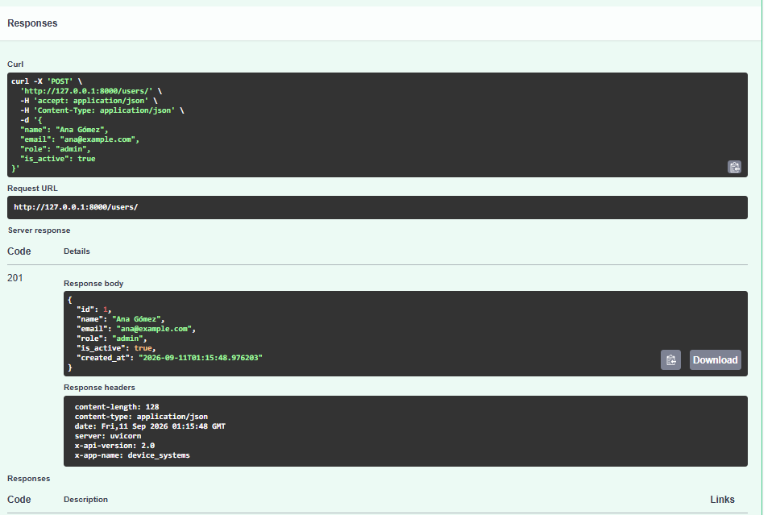

---

# 🔎 GET /users/

Permite consultar todos los usuarios almacenados.

### Código esperado

```text
200 OK
```

### 📸 Evidencia

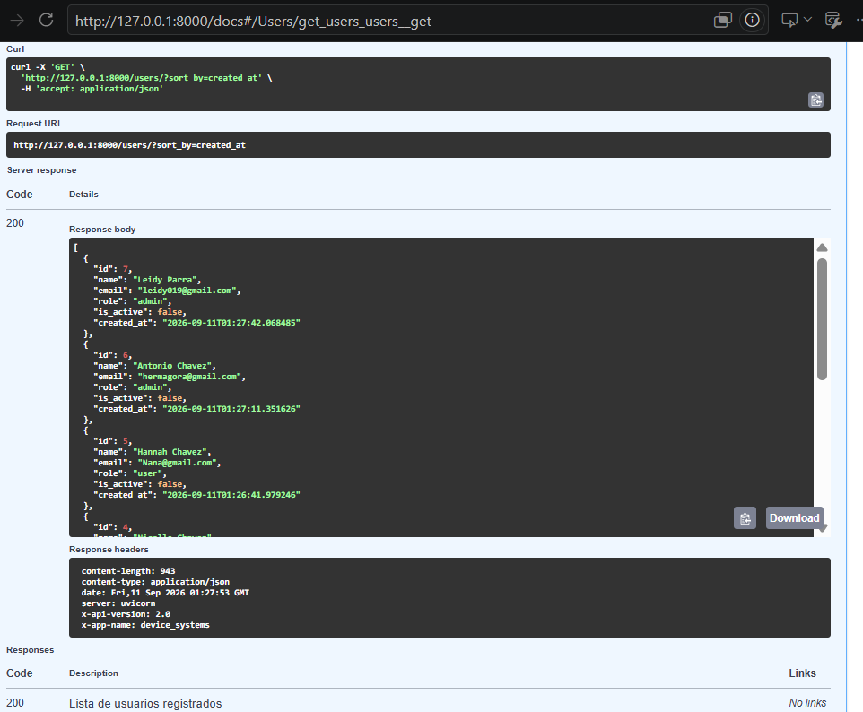

---

# 🔍 GET /users/{user_id}

Permite buscar un usuario mediante su ID.

### Código esperado

```text
200 OK
```

Si el usuario no existe:

```text
404 Not Found
```

### 📸 Evidencia

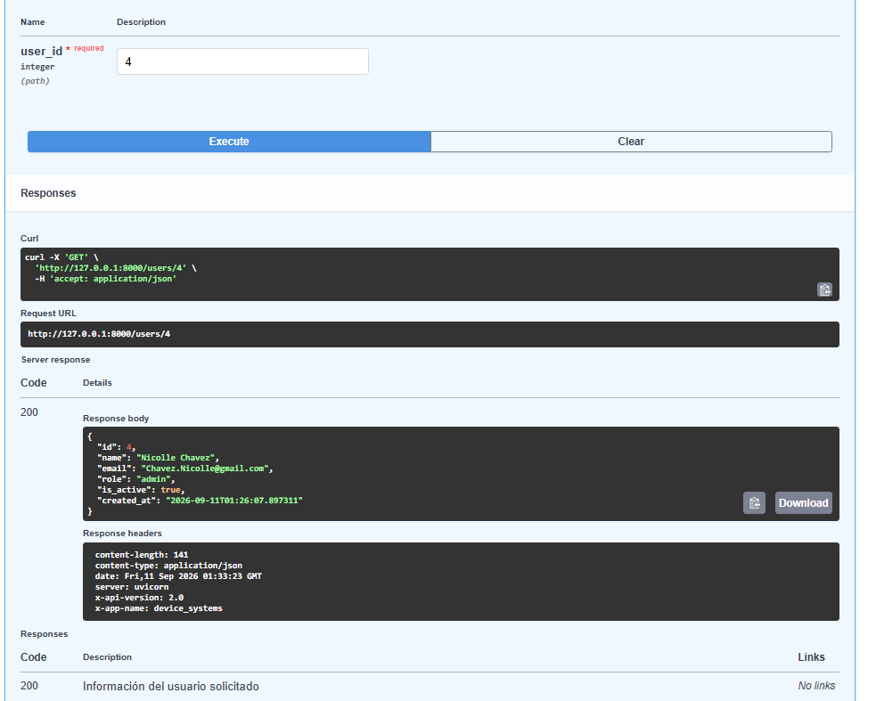

---

# 📧 GET /users/email/{email}

Permite buscar un usuario utilizando su dirección de correo electrónico.

Si existe un usuario asociado al correo, la API devuelve su información.

Si no existe ningún usuario con ese correo, la API devuelve:

```text
404 Not Found
```

### 📸 Evidencia

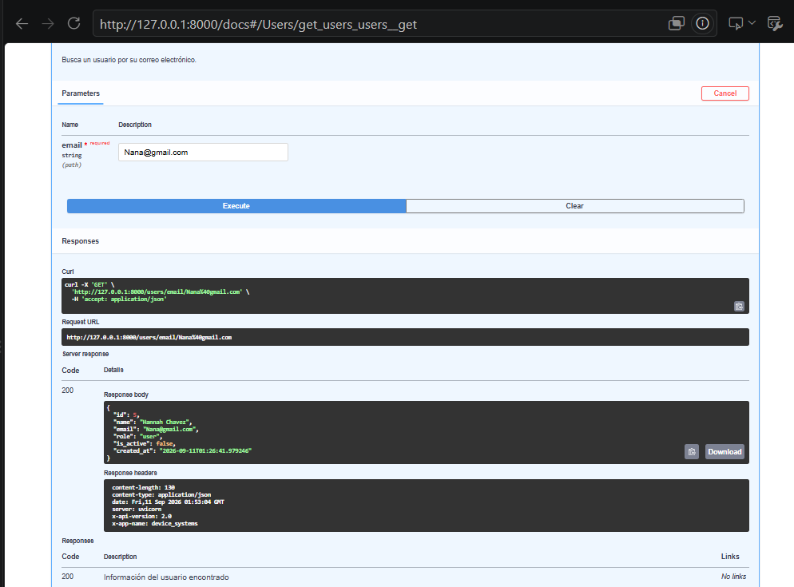

### 📸 Evidencia de correo inexistente

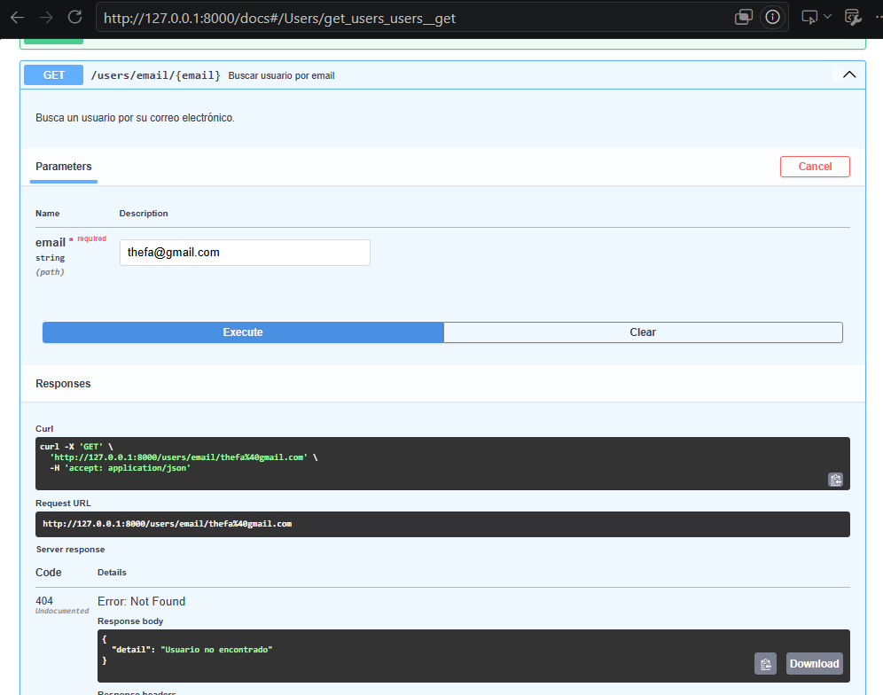

Esta prueba corresponde a la búsqueda de un correo que no pertenece a ningún usuario registrado.

---

# 🔎 Filtros por rol

La API permite filtrar los usuarios utilizando el Query Parameter `role`.

Ejemplo:

```text
GET /users/?role=admin
```

Los roles disponibles son:

```text
admin
support
user
```

### 📸 Evidencia

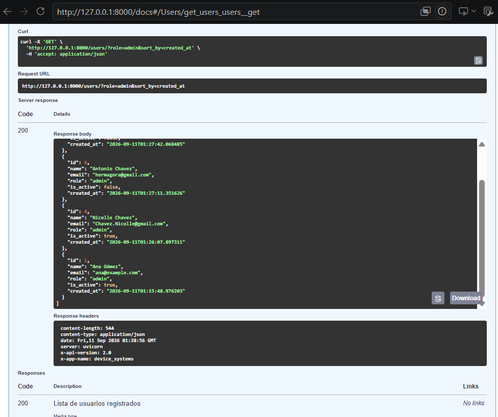

---

# 🟢 Filtro por estado activo

Para consultar solamente los usuarios activos:

```text
GET /users/?is_active=true
```

### 📸 Evidencia

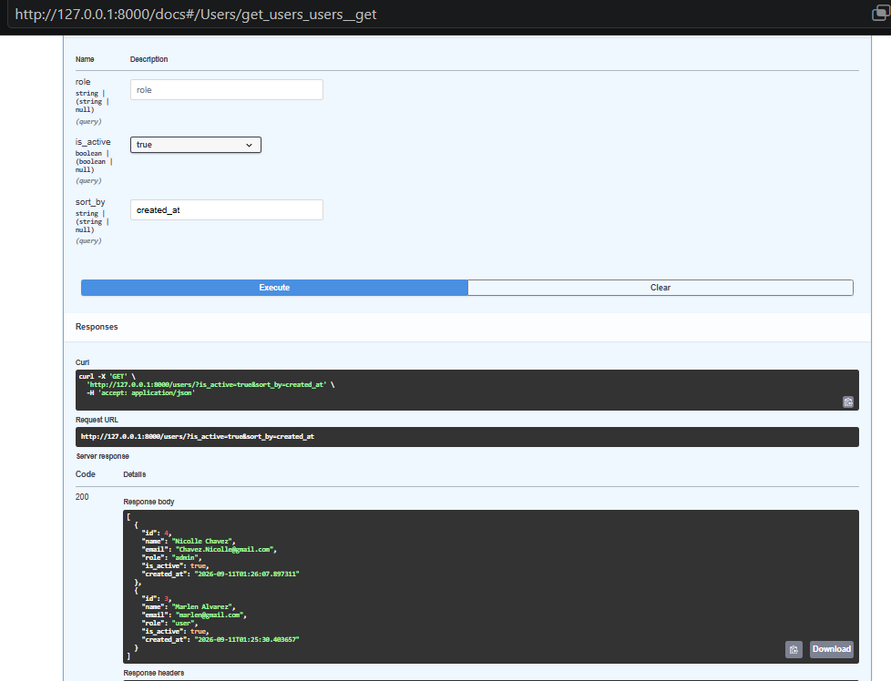

---

# ⚪ Filtro por estado inactivo

Para consultar los usuarios inactivos:

```text
GET /users/?is_active=false
```

### 📸 Evidencia

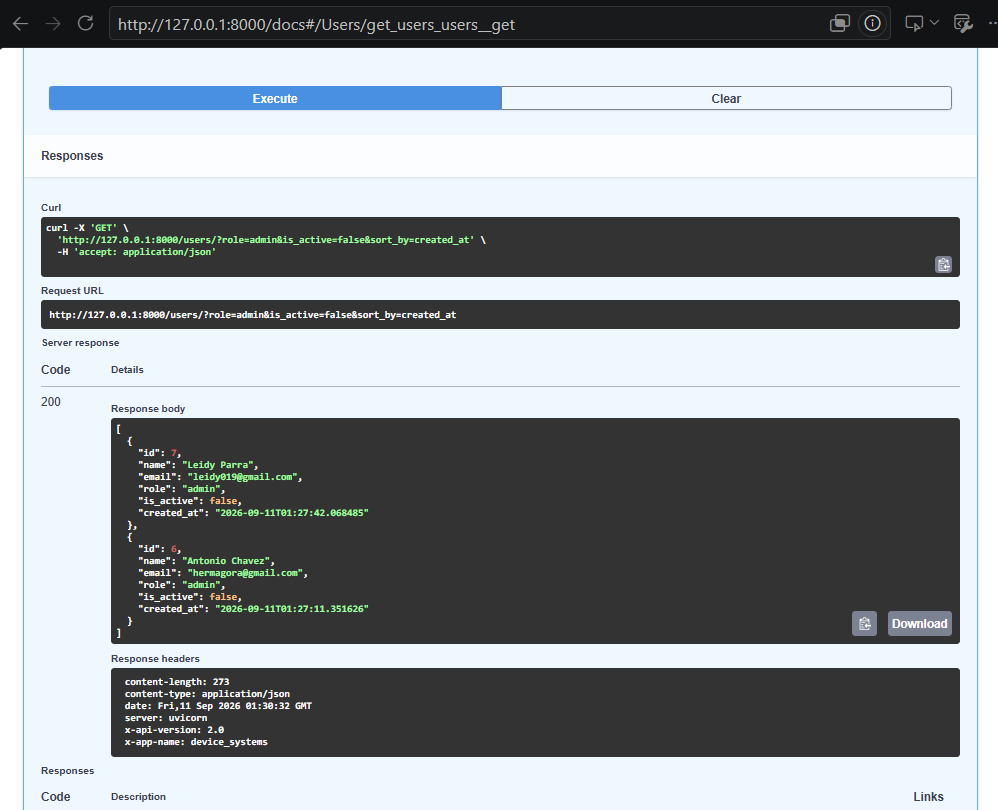

---

# 📅 Ordenamiento por fecha de creación

La API permite ordenar los usuarios teniendo en cuenta su fecha de creación.

### 📸 Evidencia

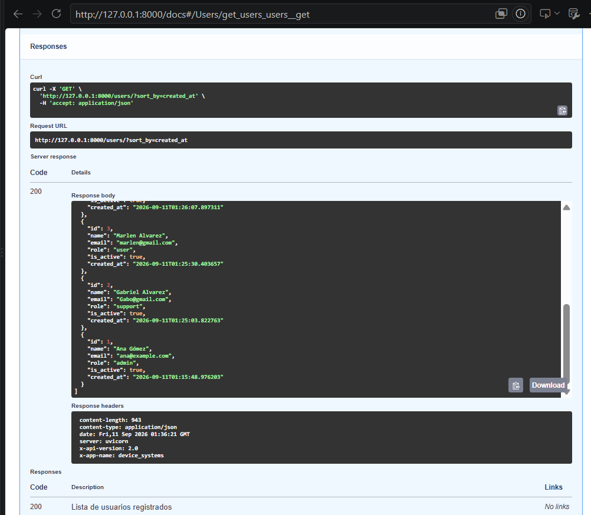

---

# ✏️ PUT /users/{user_id}

Permite actualizar completamente un usuario.

### 📸 Evidencia de actualización completa

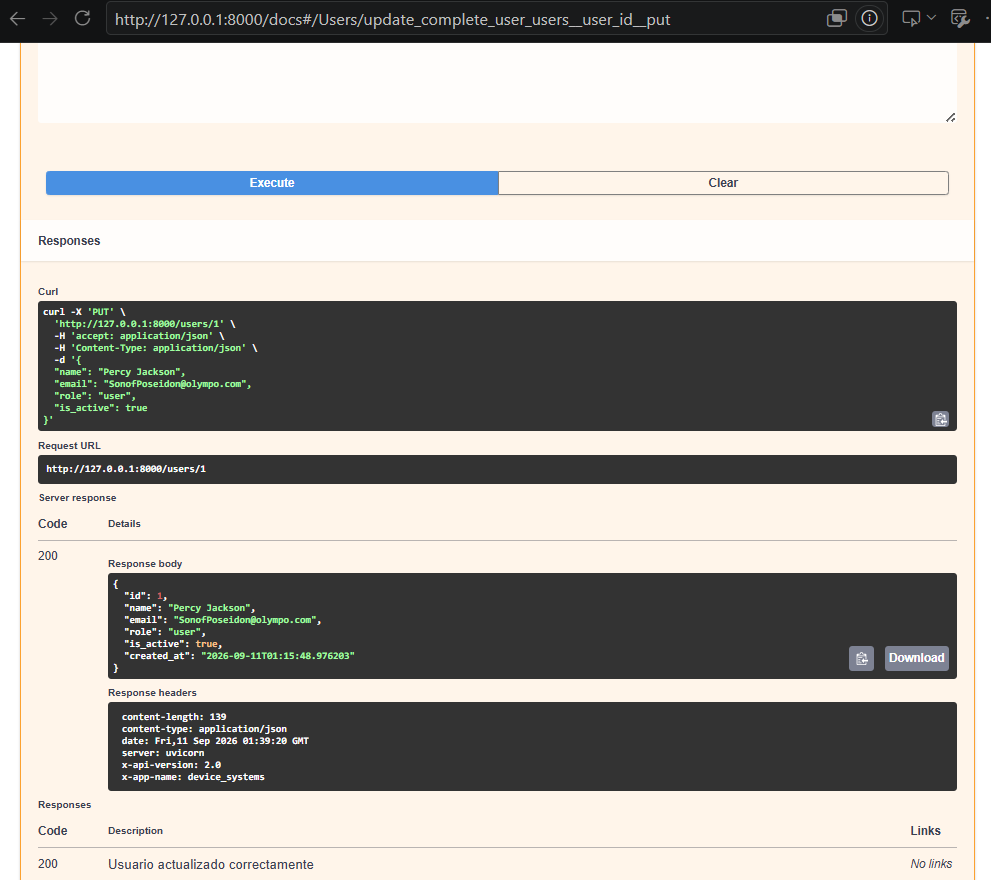

---

# 🩹 PATCH /users/{user_id}

Permite actualizar parcialmente un usuario.

### 📸 Evidencia de actualización parcial

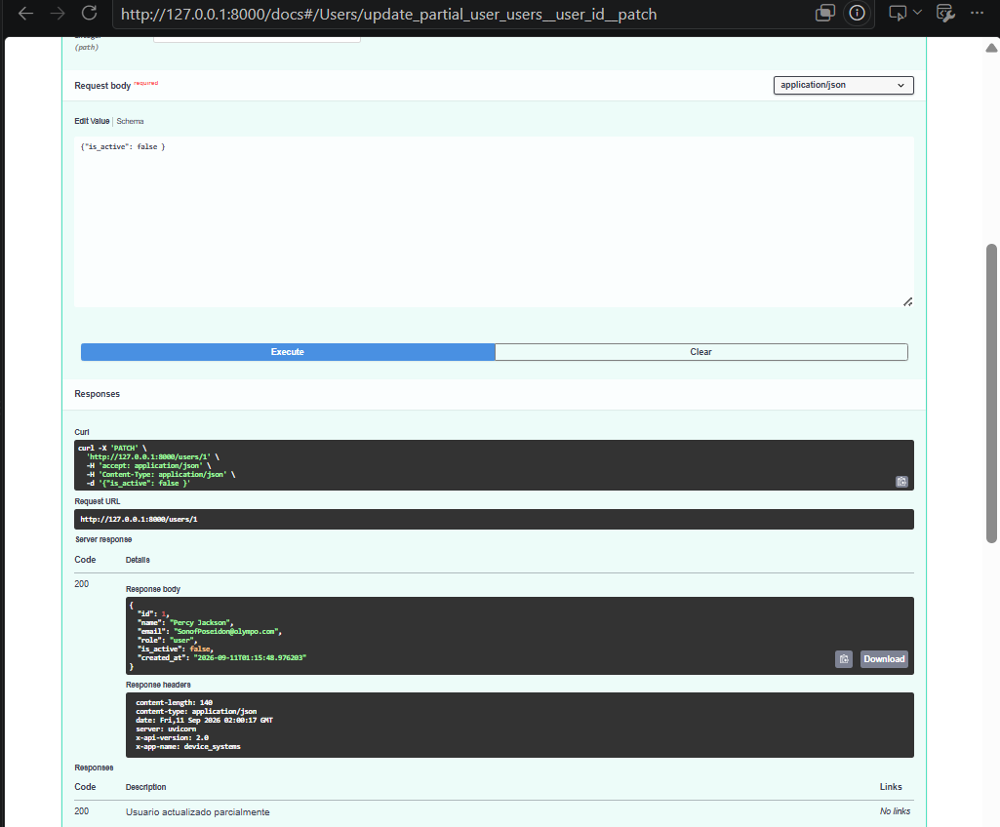

### 📸 Evidencia de campos intactos


---

# 🗑️ DELETE /users/{user_id}

Permite eliminar un usuario existente de la base de datos.

### 📸 Evidencia

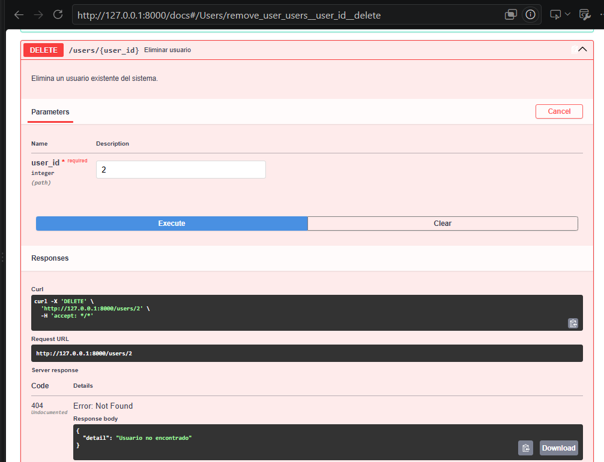

---

# 🖥️ Endpoints de dispositivos y préstamos

Además de los endpoints de usuarios, la API incorpora operaciones para administrar dispositivos y préstamos.

## 💻 Devices

| Método | Endpoint | Descripción |
| ------ | -------- | ----------- |
| GET | `/devices/` | Lista y filtra dispositivos por tipo, disponibilidad, marca y búsqueda. |
| GET | `/devices/{device_id}` | Consulta un dispositivo. |
| GET | `/devices/{device_id}/loans` | Consulta su historial de préstamos. |
| POST | `/devices/` | Crea un dispositivo. |
| PUT | `/devices/{device_id}` | Actualiza completamente un dispositivo. |
| PATCH | `/devices/{device_id}` | Actualiza parcialmente un dispositivo. |
| DELETE | `/devices/{device_id}` | Elimina un dispositivo sin préstamos registrados. |

### Filtros disponibles

```text
GET /devices/?device_type=laptop
GET /devices/?is_available=true
GET /devices/?brand=lenovo
GET /devices/?search=thinkpad
```

## 📦 Loans

| Método | Endpoint | Descripción |
| ------ | -------- | ----------- |
| GET | `/loans/` | Lista préstamos y aplica filtros avanzados. |
| GET | `/loans/details` | Lista préstamos con usuario y dispositivo relacionados. |
| GET | `/loans/{loan_id}` | Consulta un préstamo detallado. |
| GET | `/loans/users/{user_id}` | Consulta préstamos por usuario. |
| GET | `/loans/devices/{device_id}` | Consulta préstamos por dispositivo. |
| POST | `/loans/` | Registra un préstamo. |
| PATCH | `/loans/{loan_id}/return` | Registra la devolución de un dispositivo. |

### Filtros disponibles

```text
GET /loans/?status=active
GET /loans/?user_email=aprendiz@sena.edu.co
GET /loans/?device_type=laptop
GET /loans/?search=lenovo
```

## 🔗 Consultas con relaciones y `join()`

El servicio de préstamos utiliza consultas relacionadas entre `Loan`, `User` y `Device`.

El endpoint:

```text
GET /loans/details
```

permite obtener información del préstamo junto con los datos reales del usuario y del dispositivo asociado.

La respuesta contiene información como:

```json
{
  "loan_id": 1,
  "status": "active",
  "user": {
    "id": 1,
    "name": "Ana Perez",
    "email": "ana@sena.edu.co"
  },
  "device": {
    "id": 1,
    "name": "Laptop Lenovo ThinkPad",
    "serial_number": "LEN-EVID-001",
    "device_type": "laptop"
  }
}
```

## 🔄 Devolución de un dispositivo

El flujo de devolución es:

1. Se valida que el préstamo exista.
2. Se rechaza la operación si ya tiene estado `returned`.
3. Se asigna la fecha de devolución.
4. Se actualiza el estado a `returned`.
5. Se cambia `Device.is_available` a `true`.

## 🚫 Reglas de negocio y errores

La versión actual controla, entre otros, los siguientes casos:

* Un usuario inexistente produce `404 Not Found`.
* Un dispositivo inexistente produce `404 Not Found`.
* Un dispositivo ocupado produce `409 Conflict`.
* Un préstamo inexistente produce `404 Not Found`.
* Devolver un préstamo ya devuelto produce `409 Conflict`.
* Un correo o serial duplicado produce `400 Bad Request`.
* Un préstamo requiere un usuario y un dispositivo existentes.
* Los datos que no cumplen los schemas Pydantic producen `422 Unprocessable Entity`.
* No se permite eliminar un usuario o dispositivo con préstamos registrados.
* Una devolución cambia el préstamo a `returned`, registra `return_date` y actualiza `is_available` a `true`.

# 🌐 Estado de la API

El endpoint:

```text
GET /
```

permite verificar que la API se encuentra funcionando correctamente.

### 📸 Evidencia

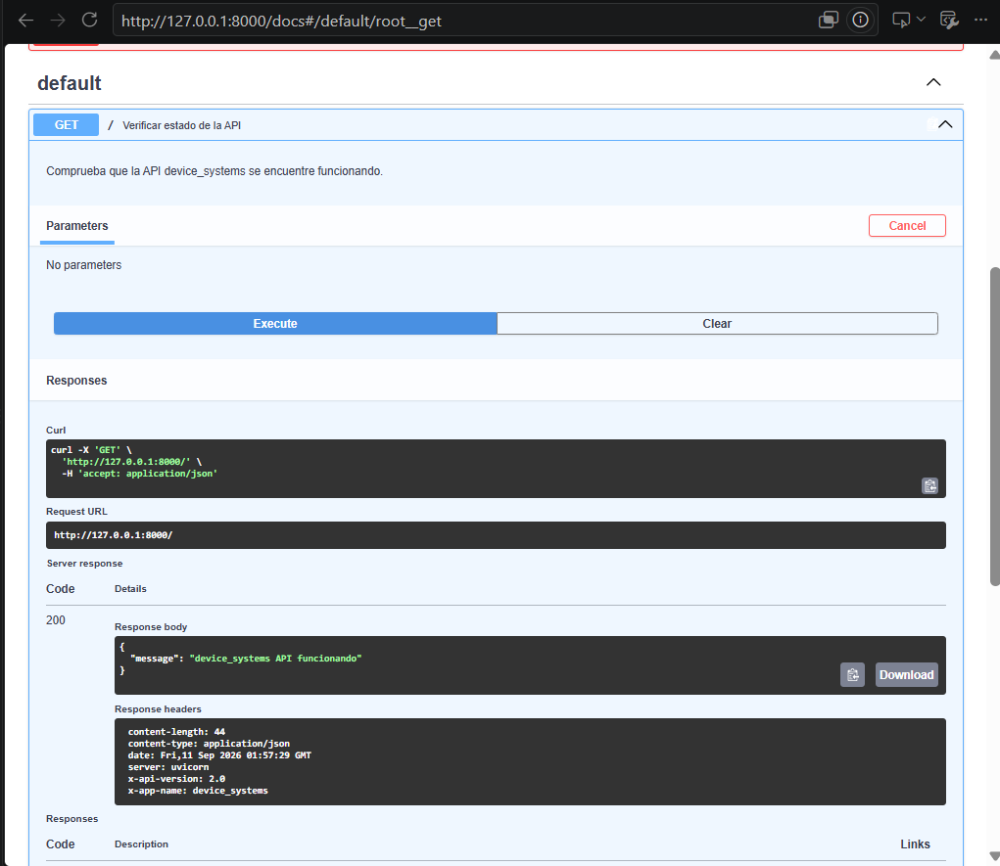

---

# 🗄️ Prueba de conexión con la base de datos

El endpoint:

```text
GET /test-db/
```

permite comprobar que la aplicación puede conectarse correctamente con SQLite.

### 📸 Evidencia


---

# 🚫 Manejo de errores controlados

La API utiliza `HTTPException` para controlar diferentes situaciones de error.

Los principales errores controlados son:

* Usuario no encontrado.
* Email duplicado.
* Email inexistente.
* Datos inválidos.
* Eliminación de usuario inexistente.
* Actualización de usuario inexistente.

---

# ❌ Usuario no encontrado

Cuando se consulta un usuario mediante un ID que no existe, la API responde:

```text
404 Not Found
```

### 📸 Evidencia

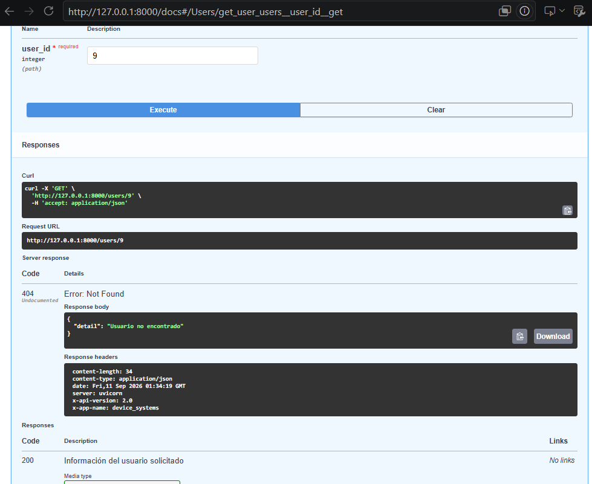

---

# 📩 Email duplicado

La API verifica que el email no esté registrado antes de crear o actualizar un usuario.

Si se intenta utilizar un email que ya pertenece a otro usuario, se controla el error y se devuelve:

```text
400 Bad Request
```

### 📸 Evidencia

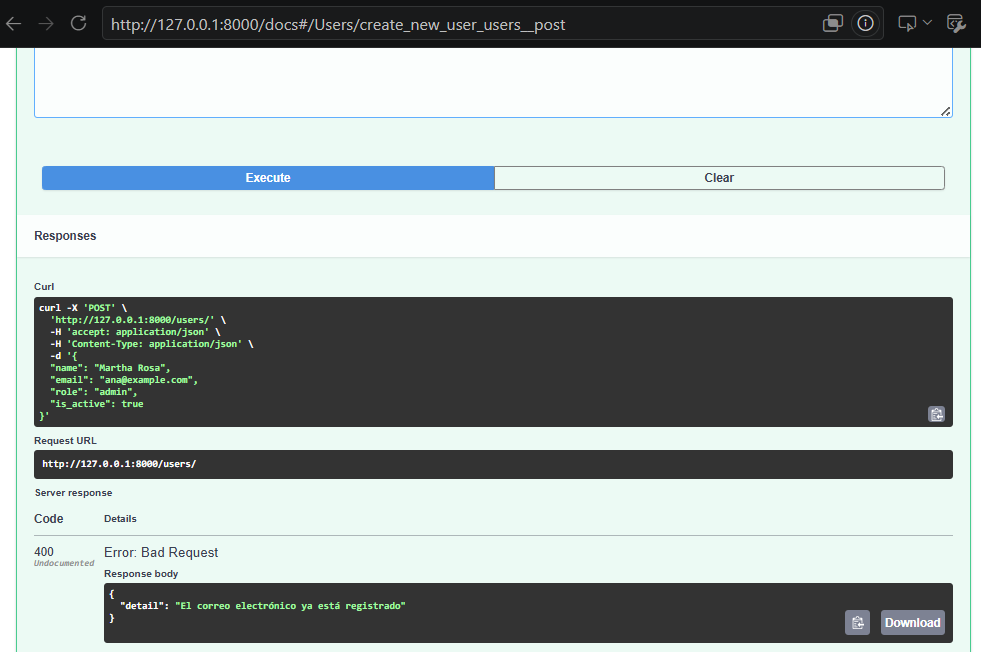

La captura muestra el caso en el que se intenta registrar un usuario utilizando un correo que ya se encuentra registrado.

---

# 📧 Email inexistente

Este caso es diferente al email duplicado.

Cuando se realiza una búsqueda mediante:

```text
GET /users/email/{email}
```

y no existe ningún usuario registrado con ese correo, la API responde:

```text
404 Not Found
```

### 📸 Evidencia


---

# ⚠️ Datos inválidos

Cuando los datos enviados no cumplen las reglas establecidas por Pydantic, FastAPI genera una respuesta:

```text
422 Unprocessable Entity
```

Algunos ejemplos son:

* Nombre demasiado corto.
* Email inválido.
* Rol no permitido.
* Tipo de dato incorrecto.

### 📸 Evidencia

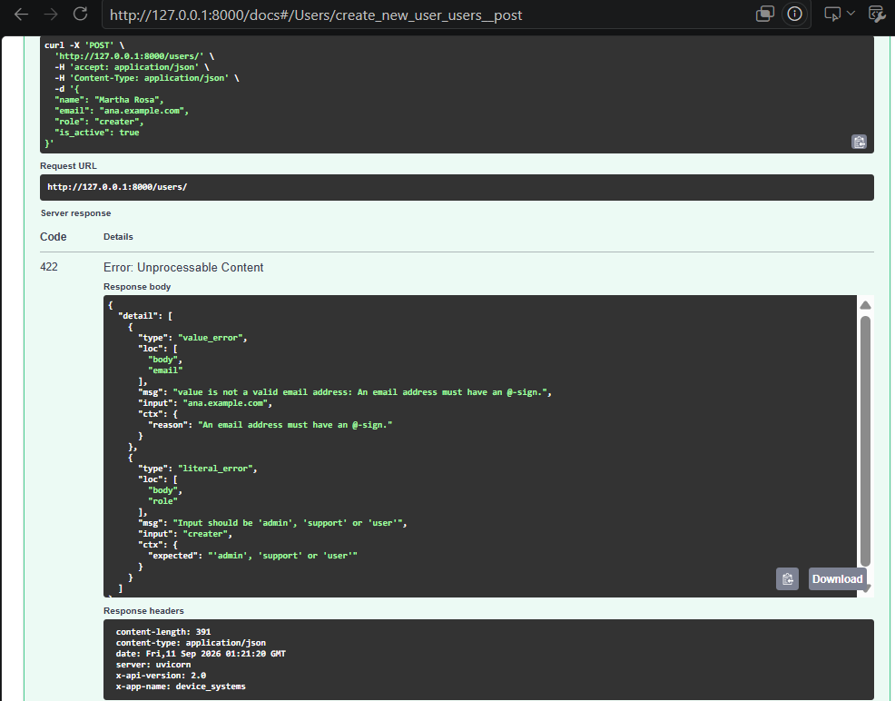

---

# 📊 Códigos de estado HTTP

La API utiliza códigos de estado para informar el resultado de cada operación.

| Código | Significado          | Ejemplo                                   |
| ------ | -------------------- | ----------------------------------------- |
| 200    | OK                   | Consulta o actualización exitosa          |
| 201    | Created              | Usuario creado                            |
| 204    | No Content           | Usuario eliminado                         |
| 400    | Bad Request          | Email duplicado                           |
| 404    | Not Found            | Usuario inexistente o email no encontrado |
| 422    | Unprocessable Entity | Datos inválidos                           |

El uso de estos códigos permite que el cliente de la API pueda identificar correctamente el resultado de cada petición.

---

# 💉 Dependency Injection con Depends()

La aplicación utiliza **Dependency Injection** mediante `Depends()`.

Las dependencias se encuentran organizadas en:

```text
app/dependencies/
```

Entre ellas se encuentra la dependencia encargada de proporcionar la sesión de la base de datos.

El uso de `Depends()` permite reutilizar lógica y evita crear manualmente una nueva sesión de base de datos en cada endpoint.

Conceptualmente:

```python
def get_db():
    db = SessionLocal()

    try:
        yield db
    finally:
        db.close()
```

Esta dependencia puede ser utilizada en las rutas mediante:

```python
Depends(get_db)
```

De esta forma, cada endpoint puede recibir la sesión de base de datos que necesita para realizar sus operaciones.

También permite centralizar el manejo y cierre de las sesiones.

---

# 🧩 Separación de responsabilidades

La aplicación se encuentra organizada en diferentes capas:

```text
                     Cliente
                        │
                        ▼
                   FastAPI
                        │
                        ▼
                     Routes
                        │
                        ▼
                    Services
                        │
                        ▼
                   SQLAlchemy
                        │
                        ▼
                     SQLite
```

Además, las dependencias proporcionan recursos reutilizables a las rutas.

### Routes

Definen los endpoints y reciben las peticiones HTTP.

### Schemas

Validan y estructuran los datos mediante Pydantic.

### Services

Contienen la lógica necesaria para realizar las operaciones CRUD.

### Models

Representan las tablas de la base de datos mediante SQLAlchemy.

### Database

Contiene la configuración del motor y las sesiones de conexión.

### Dependencies

Permiten reutilizar recursos y lógica mediante `Depends()`.

---

# 📚 Swagger UI y OpenAPI

FastAPI genera automáticamente documentación interactiva mediante **Swagger UI**.

Swagger permite:

* Visualizar los endpoints.
* Consultar parámetros.
* Consultar schemas.
* Ejecutar peticiones.
* Revisar respuestas.
* Probar diferentes escenarios.
* Consultar códigos de estado HTTP.

La documentación se encuentra disponible en:

```text
http://127.0.0.1:8000/docs
```

### 📸 Evidencia Swagger/OpenAPI


---

# 📘 ReDoc

FastAPI también proporciona documentación mediante ReDoc.

Se encuentra disponible en:

```text
http://127.0.0.1:8000/redoc
```

### 📸 Evidencia


---

# 🧪 Resumen de pruebas realizadas

Durante el desarrollo se realizaron pruebas para verificar las diferentes funcionalidades de la API.

| Funcionalidad          | Evidencia                       |
| ---------------------- | ------------------------------- |
| Crear usuario          | `creacion_usuario.png`          |
| Listar usuarios        | `listar_usuarios.png`           |
| Buscar por ID          | `buscar_usuario_id.png`         |
| Buscar por email       | `buscar_por_email.png`          |
| Email inexistente      | `correo_inexistente.png`        |
| Filtrar por rol        | `filtracion_por_rol.png`        |
| Filtrar activos        | `filtrado_por_activo.png`       |
| Filtrar inactivos      | `filtrado_por_activo_false.png` |
| Ordenar por creación   | `orden_creacion.png`            |
| Actualización completa | `actualizacion_completa.png`    |
| Actualización parcial  | `actualizado_parcialmente.png`  |
| Campos intactos        | `campos_intactos.png`           |
| Eliminar usuario       | `eliminar_usuario.png`          |
| Estado de la API       | `estado_API.png`                |
| Conexión SQLite        | `conexion_SQLite.png`           |
| Usuario inexistente    | `usuario_nofound.png`           |
| Email duplicado        | `validacion_correo.png`         |
| Datos inválidos        | `datos_invalidos.png`           |
| Base de datos generada | `device_systems.db.png`         |

---

# 🧠 ¿Qué aprendí sobre persistencia de datos en APIs REST?

La persistencia permite que la información de una API se mantenga almacenada aunque la aplicación se cierre o se reinicie.

En una API que utiliza únicamente datos en memoria, la información puede perderse cuando el proceso termina. Al utilizar SQLite y SQLAlchemy, los usuarios quedan almacenados en una base de datos real y pueden ser consultados posteriormente.

También que la persistencia no consiste solamente en guardar información. Es necesario controlar la integridad de los datos mediante validaciones y constraints.

Pydantic permite validar los datos antes de procesarlos, mientras que SQLAlchemy permite definir cómo se representan y almacenan en la base de datos.

El uso de sesiones y operaciones como `add()`, `commit()`, `refresh()` y `delete()` permitió comprender mejor la interacción de la API con la base de datos.

---

# 💡 Reflexión final sobre la importancia de la persistencia

Como la API REST permite conservar la información de manera permanente y mantenerla disponible después de reiniciar la aplicación.

Enseña que la utilización de SQLite y SQLAlchemy permitie que los usuarios creados mediante los endpoints no dependieran únicamente de la memoria del programa.

Esto hace que la API sea más útil para un sistema real, ya que los datos pueden almacenarse, consultarse, modificarse y eliminarse de forma organizada.

Además, la separación entre Pydantic y SQLAlchemy permite que la API tenga una estructura más clara: Al Pydantic encargarse de validar los datos que recibe la aplicación y SQLAlchemy encargarse de representar y persistir esos datos en la base de datos.

Su implementación de persistencia permite comprender que la API REST no solamente debe recibir y responder peticiones, sino que debe poder manejar la información de forma confiable y mantener su integridad.

---

# 🔄 Migraciones con Alembic

La versión actual utiliza **Alembic** para versionar y aplicar los cambios realizados en la estructura de la base de datos.

La configuración principal se encuentra en:

```text
alembic.ini
```

La metadata de los modelos se importa desde:

```text
app.database.connection.Base
```

en:

```text
alembic/alembic/env.py
```

### Comandos utilizados

```powershell
alembic history
alembic current
alembic upgrade head
alembic check
alembic revision --autogenerate -m "describe the schema change"
```

La cadena actual de migraciones contiene revisiones para la creación y evolución de las tablas `users`, `devices` y `loans`.

`alembic check` permite verificar que no existan cambios pendientes de migrar.

### 📸 Evidencias de Alembic

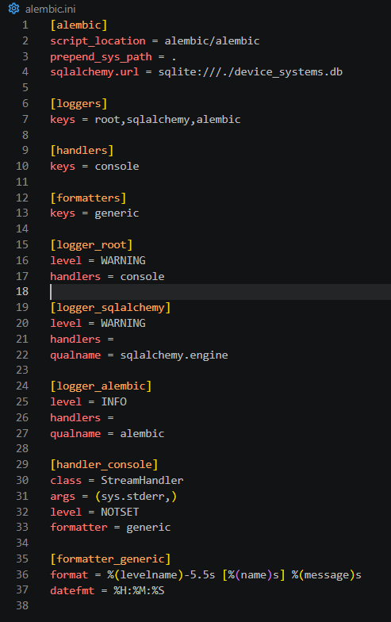

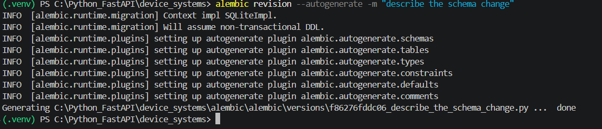

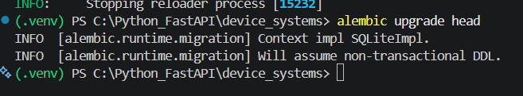

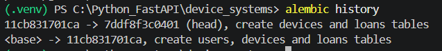

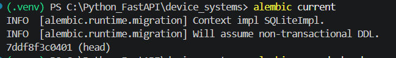

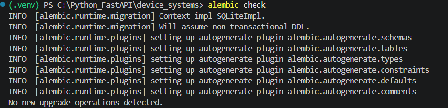

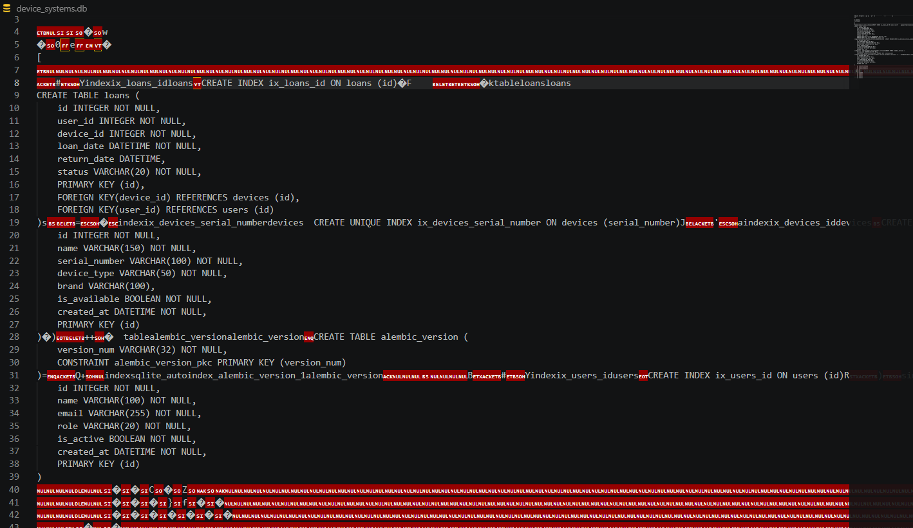

# ▶️ Ejecución del proyecto

Para ejecutar el proyecto se debe tener Python instalado.

## 1. Crear el entorno virtual

```bash
python -m venv .venv
```

## 2. Activar el entorno virtual

En Git Bash:

```bash
source .venv/Scripts/activate
```

En PowerShell:

```powershell
.\.venv\Scripts\Activate.ps1
```

## 3. Instalar las dependencias

```bash
pip install -r requirements.txt
```

## 4. Aplicar las migraciones

```powershell
alembic upgrade head
```

## 5. Ejecutar la API

```bash
uvicorn app.main:app --reload
```

La API estará disponible en:

```text
http://127.0.0.1:8000
```

Swagger UI:

```text
http://127.0.0.1:8000/docs
```

ReDoc:

```text
http://127.0.0.1:8000/redoc
```

---

# 📦 Tecnologías utilizadas

| Tecnología     | Uso                                    |
| -------------- | -------------------------------------- |
| 🐍 Python      | Lenguaje de programación               |
| ⚡ FastAPI      | Framework para desarrollar la API REST |
| 🚀 Uvicorn     | Servidor ASGI                          |
| 🟡 Pydantic    | Validación y schemas                   |
| 🗄️ SQLAlchemy | ORM y persistencia                     |
| 💾 SQLite      | Base de datos                          |
| 🌐 Swagger UI  | Documentación y pruebas                |
| 📘 ReDoc       | Documentación OpenAPI                  |
| 🔧 Git         | Control de versiones                   |
| 🐙 GitHub      | Repositorio del proyecto               |

---

# 🧠 ¿Qué aprendí sobre la evolución de una API REST?

La evolución de `device_systems` permitió pasar de una API centrada en la gestión de usuarios a un sistema que también administra dispositivos tecnológicos y préstamos.

La implementación de relaciones entre `User`, `Device` y `Loan` permitió comprender cómo diferentes recursos pueden trabajar de forma conjunta dentro de una API REST.

También se reforzó el uso de **SQLAlchemy** para representar las relaciones entre tablas y realizar consultas relacionadas mediante `join()`, además de utilizar **Alembic** para versionar la estructura de la base de datos.

La incorporación de reglas de negocio permitió controlar situaciones como dispositivos no disponibles, préstamos inexistentes, devoluciones repetidas y registros duplicados.

# 💡 Reflexión final sobre la importancia de la persistencia y las relaciones

La persistencia permite conservar la información de usuarios, dispositivos y préstamos incluso después de reiniciar la aplicación.

La implementación de préstamos demuestra que una API REST no solamente debe almacenar registros independientes, sino que también debe mantener relaciones entre ellos y aplicar reglas que protejan la integridad de la información.

El uso conjunto de Pydantic, SQLAlchemy y Alembic permite validar los datos, representar las tablas y relaciones, y controlar la evolución del esquema de la base de datos.

La separación entre modelos, schemas, servicios, rutas, dependencias y migraciones mantiene una estructura organizada y facilita el mantenimiento del proyecto.

# 🧪 Pruebas funcionales de la versión actual

La versión actual incorpora pruebas funcionales para verificar los escenarios principales de la actividad:

1. Ejecutar migraciones con Alembic.
2. Crear usuario.
3. Crear dispositivo.
4. Crear préstamo.
5. Intentar prestar un dispositivo no disponible.
6. Listar préstamos con información de usuario y dispositivo.
7. Filtrar préstamos por estado.
8. Filtrar préstamos por tipo de dispositivo.
9. Consultar préstamos de un usuario.
10. Devolver un dispositivo.
11. Verificar que el dispositivo vuelva a estar disponible.
12. Consultar el historial de préstamos del dispositivo.

Para ejecutar las pruebas:

```powershell
python -m pytest -q
```

Resultado validado en la versión entregada: **10 pruebas aprobadas**.

# ✅ Conclusión

El proyecto `device_systems` evolucionó de una API básica de gestión de usuarios a una API REST para la gestión de **usuarios, dispositivos tecnológicos y préstamos**, con persistencia mediante SQLite y SQLAlchemy, CRUD completo, validaciones con Pydantic, manejo de errores, filtros, consultas por email, actualización completa y parcial, relaciones entre modelos, consultas con `join()`, devolución de dispositivos, Dependency Injection, migraciones con Alembic y documentación mediante Swagger/OpenAPI y ReDoc.

La estructura del proyecto permite separar las responsabilidades de cada componente y facilita la incorporación de nuevas funcionalidades.

La implementación de Alembic permite versionar la estructura de la base de datos, mientras que las pruebas funcionales con Pytest permiten verificar los principales flujos de la aplicación.

# 👩‍💻 Autora

**Esthefany Valentina Chávez Parra**

**Tecnología en Análisis y Desarrollo de Software (ADSO)**

**SENA**
