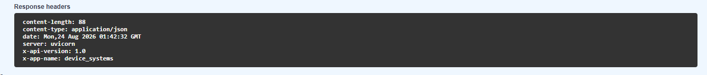

# 🚀 API REST de Gestión de Usuarios - device_systems

Repositorio correspondiente a la actividad **Fundamentos de FastAPI: API REST para Gestión de Usuarios** del programa **Tecnología en Análisis y Desarrollo de Software (ADSO)** del **SENA**.

---

# 📖 Descripción

Este proyecto corresponde al reto integrador **API REST de Usuarios para device_systems**, desarrollado utilizando **FastAPI** para implementar una API enfocada en la gestión de usuarios.

A través de esta aplicación se aplican conceptos relacionados con el desarrollo de APIs REST, validación de datos y manejo de peticiones HTTP.

Los principales conceptos implementados son:

* FastAPI.
* Uvicorn.
* Pydantic v2.
* Métodos HTTP GET y POST.
* Path Parameters.
* Query Parameters.
* Validación de datos.
* Response Models.
* Cabeceras HTTP personalizadas.
* Manejo de errores.
* Documentación mediante Swagger UI.

---

# 📂 Estructura del proyecto

```text
device_systems/
│
├── .venv/
│
├── app/
│   │
│   ├── routes/
│   │   └── user_routes.py
│   │
│   └── schemas/
│       └── user_schema.py
│
├── docs/
│   └── capturas/
│       ├── swagger.png
│       ├── get-users.png
│       ├── get-user-id.png
│       ├── post-user.png
│       ├── validaciones.png
│       └── errores.png
│
├── README.md
└── requirements.txt
```

---

# 📚 Contenido del proyecto

## 🟢 Gestión de usuarios

El recurso principal de la API es **users**, encargado de gestionar la información de los usuarios del sistema.

Cada usuario contiene los siguientes datos:

* `id`
* `name`
* `email`
* `role`
* `is_active`

Los roles permitidos son:

```text
admin
support
user
```

La información de los usuarios se utiliza para realizar las diferentes consultas y registros mediante los endpoints de la API.

---

## 🟡 Validación de datos con Pydantic

Para validar la información recibida por la API se utilizan modelos creados con **Pydantic v2**.

Entre las validaciones implementadas se encuentran:

* El nombre es obligatorio.
* El nombre debe tener mínimo 3 caracteres.
* El correo debe tener un formato válido.
* El rol debe ser `admin`, `support` o `user`.
* `is_active` debe ser un valor booleano.

Estas validaciones permiten evitar que la API reciba información que no cumpla con las condiciones establecidas.

---

## 🔵 Endpoints de usuarios

La API cuenta con diferentes endpoints para consultar y registrar usuarios.

| Método | Endpoint                 | Función                    |
| ------ | ------------------------ | -------------------------- |
| GET    | `/users/`                | Lista todos los usuarios   |
| GET    | `/users/{user_id}`       | Consulta un usuario por ID |
| GET    | `/users/?role=admin`     | Filtra usuarios por rol    |
| GET    | `/users/?is_active=true` | Filtra usuarios por estado |
| POST   | `/users/`                | Registra un nuevo usuario  |

---

# 🔎 GET /users/

Este endpoint permite consultar todos los usuarios registrados en el sistema.

### Ejemplo

```text
GET /users/
```

La API retorna una lista con la información de los usuarios.

### 📸 Evidencia de prueba


---

# 🔍 GET /users/{user_id}

Este endpoint permite consultar un usuario específico utilizando un **Path Parameter**.

El parámetro `user_id` permite indicar el identificador del usuario que se desea consultar.

### Ejemplo

```text
GET /users/1
```

Si el usuario existe, la API devuelve su información.

Si el usuario no existe, se genera una respuesta con código `404`.

### 📸 Evidencia de prueba


---

# 🔎 Filtros mediante Query Parameters

La API permite filtrar los usuarios utilizando **Query Parameters**.

## Filtrar por rol

```text
GET /users/?role=admin
```

También se pueden utilizar los roles:

```text
admin
support
user
```

## Filtrar por estado

Para consultar usuarios activos:

```text
GET /users/?is_active=true
```

Para consultar usuarios inactivos:

```text
GET /users/?is_active=false
```

Estos parámetros permiten realizar consultas más específicas sobre los usuarios registrados.

### 📸 Evidencia


---

# ➕ POST /users/

Este endpoint permite registrar un nuevo usuario.

Los datos enviados son validados mediante el modelo de Pydantic antes de crear el usuario.

### Ejemplo de petición

```json
{
  "name": "Esthefany",
  "email": "esthefany@gmail.com",
  "role": "user",
  "is_active": true
}
```

### Ejemplo de respuesta

```json
{
  "id": 4,
  "name": "Esthefany",
  "email": "esthefany@gmail.com",
  "role": "user",
  "is_active": true
}
```

El endpoint utiliza un **Response Model** para establecer la información que será retornada en la respuesta.

### 📸 Evidencia de prueba


---

# 🚫 Validaciones y manejo de errores

La API realiza diferentes validaciones para evitar el ingreso de información incorrecta.

## Nombre inválido

El nombre debe tener como mínimo 3 caracteres.

Ejemplo:

```json
{
  "name": "AB",
  "email": "usuario@gmail.com",
  "role": "user",
  "is_active": true
}
```

La API rechaza la información debido a que el nombre no cumple con la longitud mínima.

---

## 📧 Correo inválido

El correo debe tener un formato válido.

Ejemplo:

```json
{
  "name": "Pedro",
  "email": "correo-no-valido",
  "role": "user",
  "is_active": true
}
```

Pydantic genera un error de validación.

---

## 👤 Rol inválido

El rol solamente puede ser:

```text
admin
support
user
```

Por lo tanto, un valor diferente es rechazado por la API.

---

## 📩 Correo duplicado

La API también verifica que no exista otro usuario registrado con el mismo correo electrónico.

Si se intenta registrar un correo que ya existe, se genera una respuesta:

```json
{
  "detail": "El correo electrónico ya está registrado"
}
```

con código de estado:

```text
409 Conflict
```

---

## 🔎 Usuario no encontrado

Cuando se consulta un `user_id` que no existe, la API responde con:

```text
404 Not Found
```

y muestra un mensaje indicando que el usuario no fue encontrado.

### 📸 Evidencia de validaciones


### 📸 Evidencia de errores


---

# 📨 Cabeceras HTTP personalizadas

La API utiliza cabeceras HTTP personalizadas para identificar la aplicación y su versión.

Las cabeceras implementadas son:

```text
X-App-Name: device_systems
X-API-Version: 1.0
```

Estas cabeceras son agregadas a las respuestas de la API.

### 📸 Evidencia



---

# 📋 Response Models

Los **Response Models** permiten definir la estructura de los datos que devuelve cada endpoint.

En este proyecto se utiliza el modelo `UserResponse` para establecer la información que debe retornar la API.

Esto permite mantener respuestas organizadas y evitar devolver información que no sea necesaria.

---

# 🖥️ Documentación con Swagger UI

FastAPI proporciona automáticamente una documentación interactiva mediante **Swagger UI**.

La documentación permite visualizar los endpoints disponibles y realizar pruebas directamente desde el navegador.

Para acceder a Swagger se ejecuta el servidor y se ingresa a:

```text
http://127.0.0.1:8000/docs
```

Desde Swagger es posible realizar las pruebas de los métodos GET y POST, enviar parámetros y comprobar las validaciones implementadas.

### 📸 Captura principal de Swagger UI


---

# ▶️ Ejecución del proyecto

Para ejecutar el proyecto se debe tener Python instalado.

## 1. Crear el entorno virtual

```bash
python -m venv .venv
```

## 2. Activar el entorno virtual

En Git Bash:

```bash
source .venv/Scripts/activate
```

## 3. Instalar las dependencias

```bash
pip install -r requirements.txt
```

## 4. Ejecutar el servidor

```bash
uvicorn app.main:app --reload
```

La API estará disponible en:

```text
http://127.0.0.1:8000
```

Y la documentación en:

```text
http://127.0.0.1:8000/docs
```

---

# 📦 Dependencias

Las principales tecnologías utilizadas en el proyecto son:

| Herramienta   | Uso                                        |
| ------------- | ------------------------------------------ |
| 🐍 Python     | Lenguaje utilizado para desarrollar la API |
| ⚡ FastAPI     | Framework para construir la API REST       |
| 🚀 Uvicorn    | Servidor utilizado para ejecutar FastAPI   |
| 📋 Pydantic   | Validación y definición de modelos         |
| 📦 pip        | Gestión de dependencias                    |
| 🌐 Swagger UI | Documentación y pruebas de la API          |
| 🔧 Git        | Control de versiones                       |
| 🐙 GitHub     | Repositorio del proyecto                   |

Las dependencias se encuentran registradas en:

```text
requirements.txt
```

---

# 🧩 ¿Cómo funciona el proyecto?

El funcionamiento general de la aplicación se puede representar de la siguiente manera:

```text
                    Cliente
                       │
                       ▼
                ┌─────────────┐
                │   FastAPI   │
                └──────┬──────┘
                       │
          ┌────────────┴────────────┐
          │                         │
          ▼                         ▼
     routes/                    schemas/
 user_routes.py              user_schema.py
          │                         │
          │                         │
          └────────────┬────────────┘
                       │
                       ▼
                  Respuesta API
```

Las rutas se encargan de recibir las peticiones HTTP, mientras que los modelos de Pydantic se encargan de validar la información recibida y definir la estructura de las respuestas.

---

# 📸 Evidencias de la actividad

Como parte de la actividad se realizaron diferentes pruebas para comprobar el funcionamiento de la API.

Las evidencias incluyen:

* Captura principal de Swagger UI.
* Prueba de `GET /users/`.
* Prueba de `GET /users/{user_id}`.
* Prueba de los filtros mediante Query Parameters.
* Prueba de `POST /users/`.
* Validaciones de datos incorrectos.
* Error por correo duplicado.
* Error de usuario no encontrado.
* Evidencia de las cabeceras HTTP personalizadas.

Las capturas utilizadas en el README se encuentran organizadas en:

```text
docs/capturas/
```

---

# 🧪 Pruebas realizadas

Durante el desarrollo del proyecto se realizaron pruebas para verificar el correcto funcionamiento de los diferentes endpoints.

Se probaron:

* Listado de usuarios.
* Consulta de usuario por ID.
* Filtro por rol.
* Filtro por estado activo o inactivo.
* Registro de usuarios.
* Validación del nombre.
* Validación del correo electrónico.
* Validación del rol.
* Validación del estado.
* Correos electrónicos duplicados.
* Usuarios inexistentes.
* Cabeceras HTTP personalizadas.

Las pruebas fueron realizadas utilizando principalmente **Swagger UI**.

---

# 🎯 Objetivo del proyecto

Desarrollar una API REST funcional para la gestión de usuarios utilizando FastAPI, aplicando los conceptos de métodos HTTP, parámetros de ruta, parámetros de consulta, validación de datos con Pydantic, modelos de respuesta y cabeceras HTTP.

---

# 💡 Reflexión

Durante el desarrollo de esta actividad comprendí mejor cómo funciona una **API REST** y cómo FastAPI facilita la creación de servicios web utilizando Python.

Uno de los aspectos que más me llamó la atención fue la forma en que FastAPI permite crear los endpoints de manera sencilla y además genera automáticamente la documentación mediante Swagger UI. Esto facilita bastante el proceso de realizar pruebas y comprobar el funcionamiento de la API.

También fue importante trabajar con **Path Parameters y Query Parameters**, ya que permiten realizar consultas más específicas sobre los usuarios. Por otra parte, el uso de **Pydantic** facilita la validación de los datos antes de procesarlos, evitando que la API reciba información que no cumple con las condiciones establecidas.

Los **Response Models** permiten controlar la estructura de las respuestas, mientras que las cabeceras HTTP personalizadas permiten agregar información adicional sobre la aplicación.

En general, esta actividad me permitió comprender mejor cómo se construye una API REST desde cero y cómo FastAPI puede ayudar a desarrollar aplicaciones backend de una forma organizada, rápida y fácil de probar.

---

# 👩‍💻 Autora

**Esthefany Valentina Chávez Parra**

**Tecnología en Análisis y Desarrollo de Software (ADSO)**

**SENA**
