# 🚀 API REST de Gestión de Usuarios - device_systems

Repositorio correspondiente a la actividad **FastAPI Intermedio: Evolución de device_systems con CRUD Completo, Manejo de Errores, Swagger/OpenAPI y Dependency Injection**, del programa **Tecnología en Análisis y Desarrollo de Software (ADSO)** del **SENA**.

---

# 📖 Descripción

Este proyecto corresponde a la evolución de la API REST de usuarios desarrollada en la actividad anterior.

La aplicación **device_systems** fue ampliada utilizando **FastAPI**, con el objetivo de implementar una API REST más completa y organizada para la gestión de usuarios.

En esta segunda etapa se implementó el **CRUD completo** del recurso `users`, además de nuevos mecanismos para el manejo de errores, códigos de estado HTTP, documentación automática mediante Swagger/OpenAPI y reutilización de lógica mediante **Dependency Injection con `Depends()`**.

Los principales conceptos implementados son:

* FastAPI.
* Uvicorn.
* Pydantic v2.
* Métodos HTTP GET, POST, PUT, PATCH y DELETE.
* Path Parameters.
* Query Parameters.
* Validación de datos.
* Response Models.
* Manejo de errores mediante `HTTPException`.
* Códigos de estado HTTP.
* Dependency Injection con `Depends()`.
* Organización del proyecto por responsabilidades.
* Swagger UI.
* ReDoc.
* Documentación OpenAPI.
* Cabeceras HTTP personalizadas.

---

# 🎯 Objetivo del proyecto

Transformar la API inicial de gestión de usuarios en una API REST más completa y organizada, implementando operaciones CRUD, validaciones, manejo de errores y reutilización de lógica mediante Dependency Injection.

La API permite:

* Crear usuarios.
* Listar usuarios.
* Consultar usuarios por ID.
* Filtrar usuarios por rol.
* Filtrar usuarios por estado.
* Actualizar completamente un usuario.
* Actualizar parcialmente un usuario.
* Eliminar usuarios.
* Validar los datos recibidos.
* Controlar errores mediante respuestas HTTP.
* Utilizar códigos de estado apropiados.
* Documentar automáticamente la API.
* Reutilizar lógica mediante `Depends()`.

---

# 📂 Estructura del proyecto

```text
device_systems/
│
├── app/
│   │
│   ├── data/
│   │   └── users_db.py
│   │
│   ├── dependencies/
│   │   └── user_dependencies.py
│   │
│   ├── routes/
│   │   └── user_routes.py
│   │
│   ├── schemas/
│   │   └── user_schema.py
│   │
│   ├── services/
│   │   └── user_service.py
│   │
│   └── main.py
│
├── docs/
│   └── capturas/
│       ├── DELETE_confirmacion.png
│       ├── DELETE_eliminar.png
│       ├── DELETE_noexiste.png
│       ├── errores.png
│       ├── filtros-users.png
│       ├── get-user-id.png
│       ├── get-users.png
│       ├── headers_2.0.png
│       ├── headers.png
│       ├── PATCH_campos.png
│       ├── PATCH_duplicado.png
│       ├── PATCH_inexistente.png
│       ├── PATCH_vacio.png
│       ├── PATCH.png
│       ├── post-user.png
│       ├── PUT_200.png
│       ├── PUT_400_badrequest.png
│       ├── PUT_404.png
│       ├── redoc.png
│       ├── swagger.png
│       └── validaciones.png
│
├── .gitignore
├── README.md
└── requirements.txt
```

> **Nota:** Las carpetas `.venv/` y `__pycache__/` existen durante el desarrollo local, pero no se incluyen en el repositorio de GitHub debido a las reglas definidas en `.gitignore`.

---

# 🏗️ Organización del proyecto

En esta versión se separaron las responsabilidades de la aplicación para mejorar la organización del código.

## 📁 routes

La carpeta `routes` contiene los endpoints de la API.

Archivo:

```text
app/routes/user_routes.py
```

Aquí se definen las rutas correspondientes al recurso `users`, incluyendo los métodos GET, POST, PUT, PATCH y DELETE.

## 📁 schemas

La carpeta `schemas` contiene los modelos de Pydantic utilizados para validar los datos de entrada y salida.

Archivo:

```text
app/schemas/user_schema.py
```

Los modelos permiten establecer qué información puede recibir y devolver la API.

## 📁 services

La carpeta `services` contiene la lógica relacionada con las operaciones sobre los usuarios.

Archivo:

```text
app/services/user_service.py
```

La separación de esta lógica permite evitar que todas las operaciones se encuentren directamente dentro de las rutas.

## 📁 dependencies

La carpeta `dependencies` contiene funciones reutilizables utilizadas mediante Dependency Injection.

Archivo:

```text
app/dependencies/user_dependencies.py
```

Estas dependencias permiten reutilizar validaciones y lógica común entre diferentes endpoints.

## 📁 data

La carpeta `data` contiene la información utilizada como simulación de una base de datos en memoria.

Archivo:

```text
app/data/users_db.py
```

En esta actividad no se utiliza una base de datos real. Los usuarios se almacenan temporalmente en una estructura de datos en memoria.

---

# 👤 Gestión de usuarios

El recurso principal de la API es:

```text
/users
```

Cada usuario contiene los siguientes campos:

* `id`
* `name`
* `email`
* `role`
* `is_active`

Los roles permitidos son:

```text
admin
support
user
```

---

# 🟡 Validación de datos con Pydantic

La API utiliza **Pydantic v2** para validar los datos recibidos.

Entre las validaciones implementadas se encuentran:

* El nombre es obligatorio.
* El nombre debe tener mínimo 3 caracteres.
* El correo debe tener un formato válido.
* El rol debe ser `admin`, `support` o `user`.
* `is_active` debe ser un valor booleano.
* Los datos enviados en las actualizaciones deben cumplir con las reglas establecidas.

Cuando los datos enviados no cumplen con las validaciones de Pydantic, FastAPI genera una respuesta de error con código:

```text
422 Unprocessable Entity
```

---

# 🔵 Endpoints de usuarios

La API implementa el CRUD completo del recurso `users`.

| Método | Endpoint | Función |
| ------ | -------- | ------- |
| GET | `/users/` | Lista todos los usuarios |
| GET | `/users/{user_id}` | Consulta un usuario por ID |
| GET | `/users/?role=admin` | Filtra usuarios por rol |
| GET | `/users/?is_active=true` | Filtra usuarios por estado |
| POST | `/users/` | Crea un nuevo usuario |
| PUT | `/users/{user_id}` | Actualiza completamente un usuario |
| PATCH | `/users/{user_id}` | Actualiza parcialmente un usuario |
| DELETE | `/users/{user_id}` | Elimina un usuario |

---

# 🔎 GET /users/

Este endpoint permite consultar todos los usuarios registrados.

### Ejemplo

```text
GET /users/
```

La API devuelve una lista de usuarios.

### Código de respuesta

```text
200 OK
```

### 📸 Evidencia

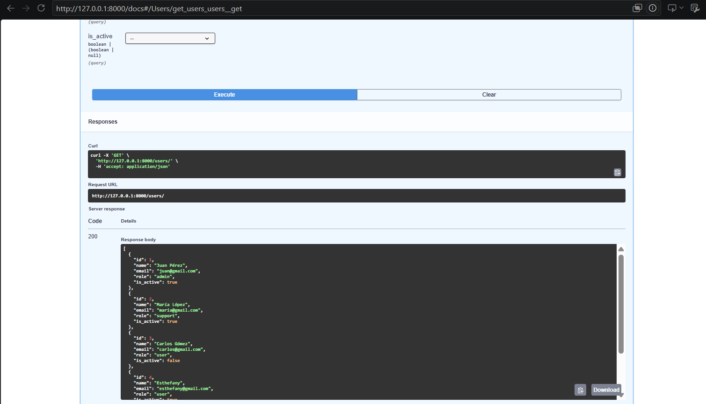

---

# 🔍 GET /users/{user_id}

Permite consultar un usuario específico mediante un **Path Parameter**.

### Ejemplo

```text
GET /users/1
```

Si el usuario existe, la API devuelve su información.

Si el usuario no existe, se genera:

```text
404 Not Found
```

### 📸 Evidencia

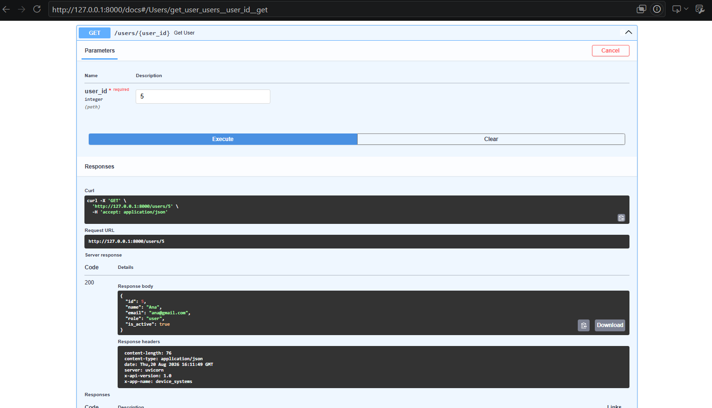

---

# 🔎 Filtros mediante Query Parameters

La API permite realizar consultas utilizando Query Parameters.

## Filtrar por rol

```text
GET /users/?role=admin
```

Los roles permitidos son:

```text
admin
support
user
```

## Filtrar por estado

Usuarios activos:

```text
GET /users/?is_active=true
```

Usuarios inactivos:

```text
GET /users/?is_active=false
```

Estos filtros permiten realizar consultas más específicas sobre los usuarios registrados.

### 📸 Evidencia

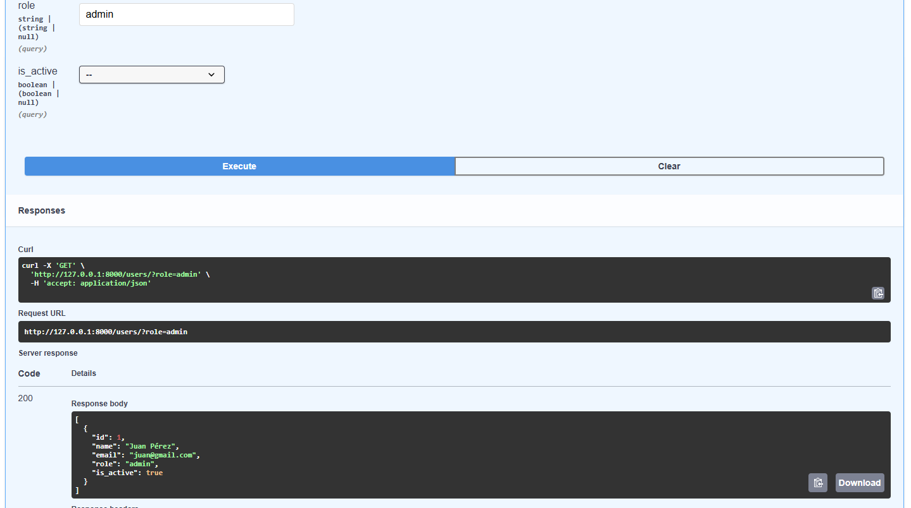

---

# ➕ POST /users/

Permite registrar un nuevo usuario.

### Ejemplo de petición

```json
{
  "name": "Esthefany",
  "email": "esthefany@gmail.com",
  "role": "user",
  "is_active": true
}
```

### Ejemplo de respuesta

```json
{
  "id": 4,
  "name": "Esthefany",
  "email": "esthefany@gmail.com",
  "role": "user",
  "is_active": true
}
```

### Código de respuesta

```text
201 Created
```

El endpoint utiliza un Response Model para definir la estructura de la respuesta.

### 📸 Evidencia

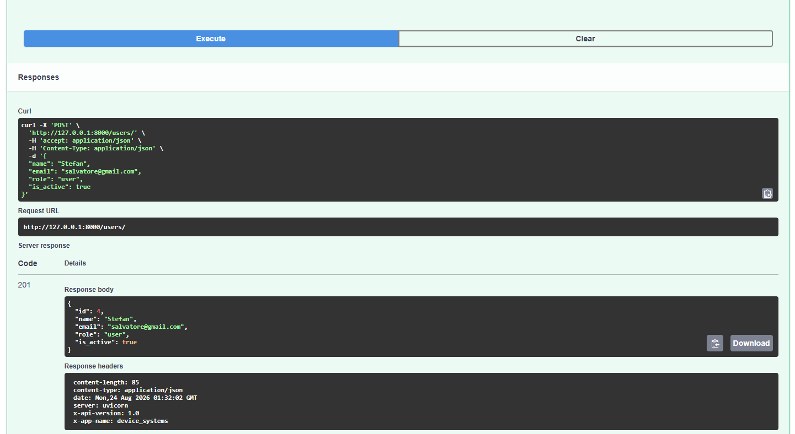

---

# ✏️ PUT /users/{user_id}

El método PUT permite realizar una **actualización completa** de un usuario existente.

Para realizar esta operación se deben enviar todos los campos requeridos:

* `name`
* `email`
* `role`
* `is_active`

### Ejemplo

```text
PUT /users/1
```

### Petición

```json
{
  "name": "Juan Pérez Actualizado",
  "email": "juan.actualizado@gmail.com",
  "role": "support",
  "is_active": true
}
```

### Respuesta

La API devuelve el usuario actualizado.

### Código de respuesta

```text
200 OK
```

Si el usuario no existe:

```text
404 Not Found
```

Si se intenta utilizar un correo que ya pertenece a otro usuario:

```text
400 Bad Request
```

### 📸 Evidencia de actualización

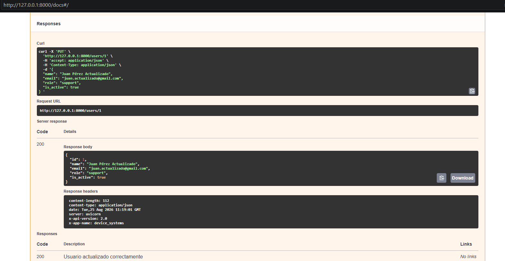

### 📸 Evidencia de Bad Request

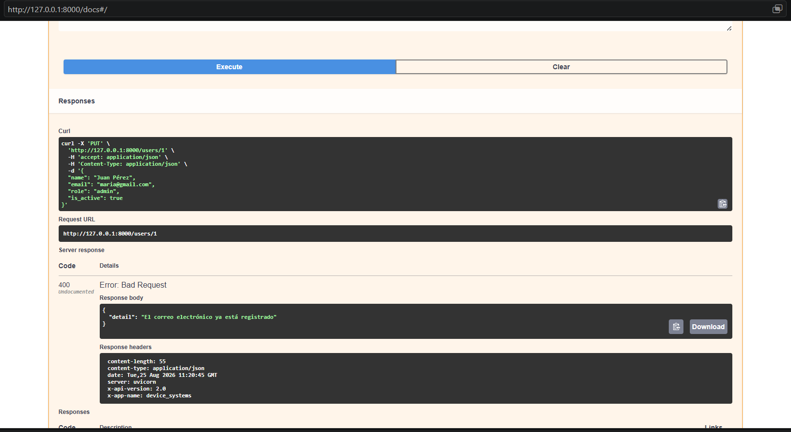

### 📸 Evidencia de usuario inexistente

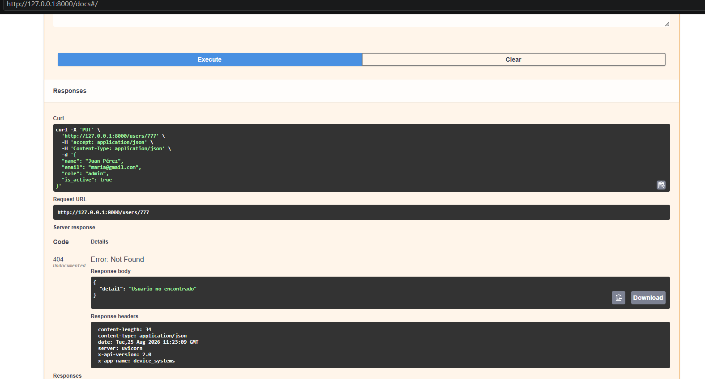

---

# 🩹 PATCH /users/{user_id}

El método PATCH permite realizar una **actualización parcial** de un usuario.

A diferencia de PUT, no es necesario enviar todos los campos.

### Ejemplo

```text
PATCH /users/1
```

### Petición

```json
{
  "role": "support"
}
```

La API modifica únicamente el campo enviado y mantiene los demás datos del usuario.

### Código de respuesta

```text
200 OK
```

## PATCH vacío

Si no se envía ningún campo para actualizar:

```text
400 Bad Request
```

## Usuario inexistente

Si el usuario no existe:

```text
404 Not Found
```

## Correo duplicado

Si la actualización utiliza un correo que ya pertenece a otro usuario, la API controla el error y devuelve una respuesta de error.

### 📸 Evidencia PATCH

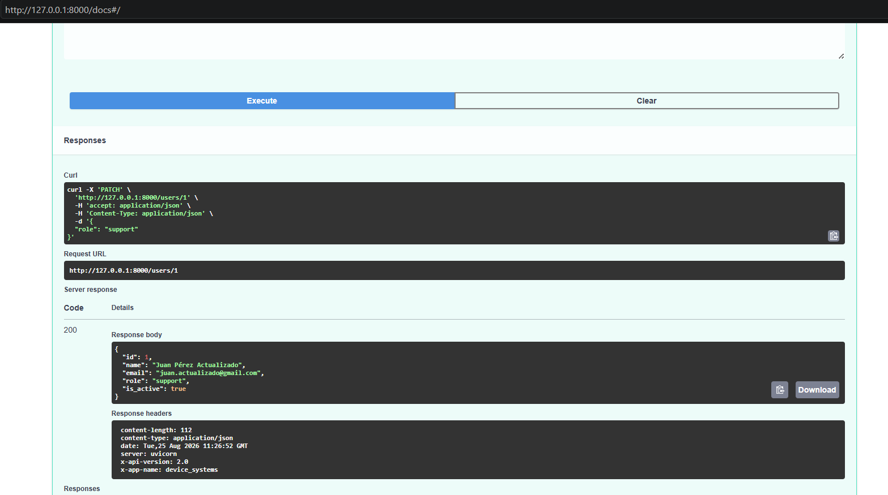

### 📸 Actualización de campos

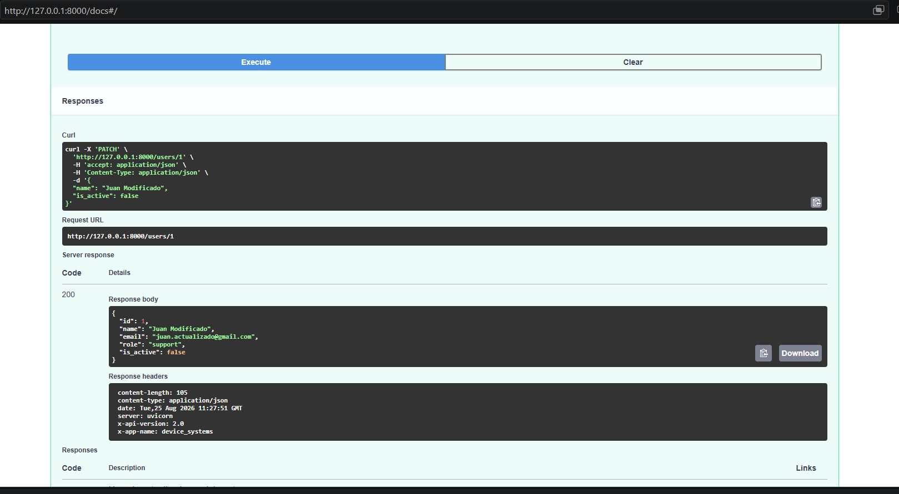

### 📸 Correo duplicado

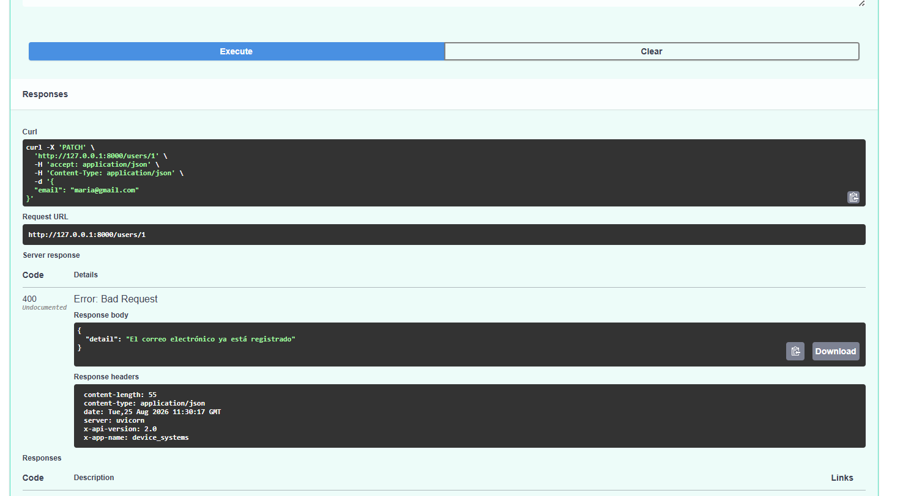

### 📸 Usuario inexistente

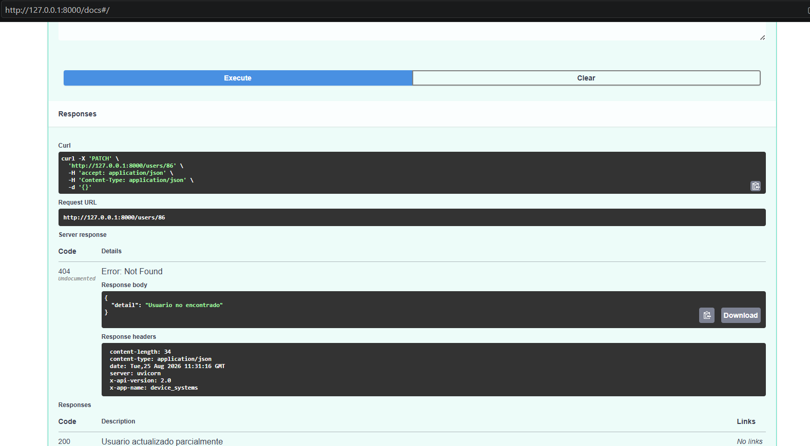

### 📸 PATCH sin datos

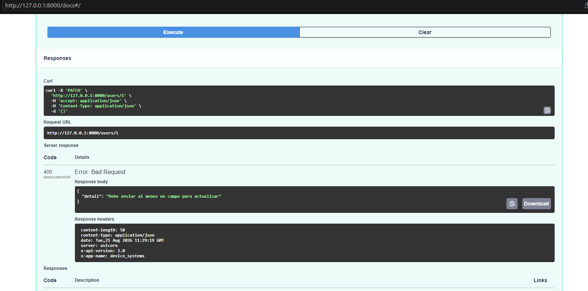

---

# 🗑️ DELETE /users/{user_id}

El método DELETE permite eliminar un usuario existente.

### Ejemplo

```text
DELETE /users/1
```

Cuando la eliminación se realiza correctamente, la API responde con:

```text
204 No Content
```

La eliminación no devuelve contenido en el cuerpo de la respuesta.

Si el usuario no existe:

```text
404 Not Found
```

### 📸 Evidencia de eliminación

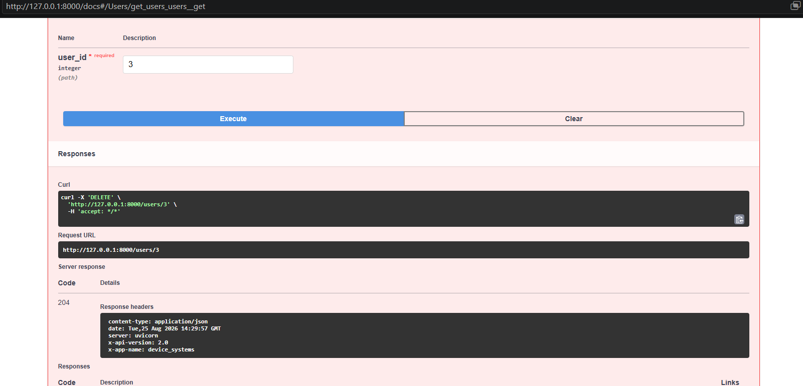

### 📸 Confirmación

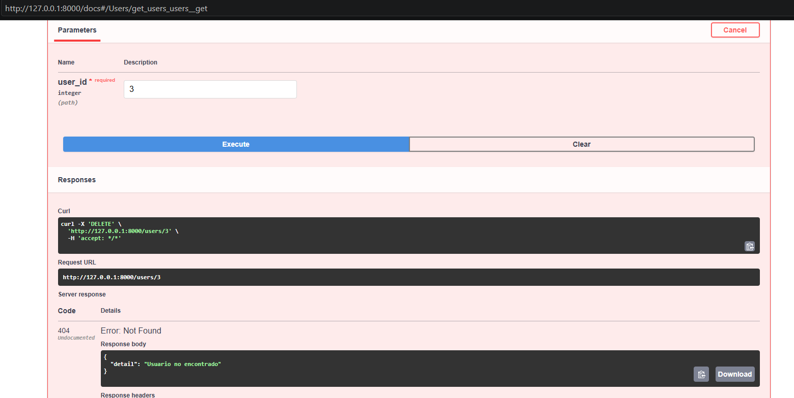

### 📸 Usuario inexistente

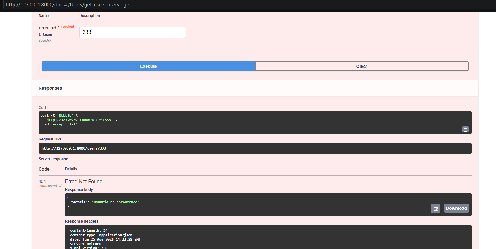

---

# 🚫 Manejo de errores

La API utiliza `HTTPException` de FastAPI para controlar diferentes situaciones de error.

Los principales errores controlados son:

* Usuario no encontrado.
* Correo electrónico duplicado.
* Datos inválidos.
* Rol no permitido.
* PATCH sin datos.
* Eliminación de un usuario inexistente.
* Actualización de un usuario inexistente.

## 🔎 Usuario no encontrado

Cuando se consulta, actualiza o elimina un usuario que no existe:

```text
404 Not Found
```

Ejemplo de respuesta:

```json
{
  "detail": "Usuario no encontrado"
}
```

## 📩 Correo duplicado

La API verifica que el correo electrónico no se encuentre registrado en otro usuario.

Cuando se intenta utilizar un correo duplicado en una operación que no lo permite, se genera:

```text
400 Bad Request
```

Ejemplo:

```json
{
  "detail": "El correo electrónico ya está registrado"
}
```

## ⚠️ Datos inválidos

Cuando los datos enviados no cumplen las validaciones de Pydantic, FastAPI devuelve:

```text
422 Unprocessable Entity
```

Por ejemplo:

* Nombre con menos de 3 caracteres.
* Correo electrónico inválido.
* Rol diferente de los valores permitidos.
* Tipo de dato incorrecto.

### 📸 Evidencia de validaciones

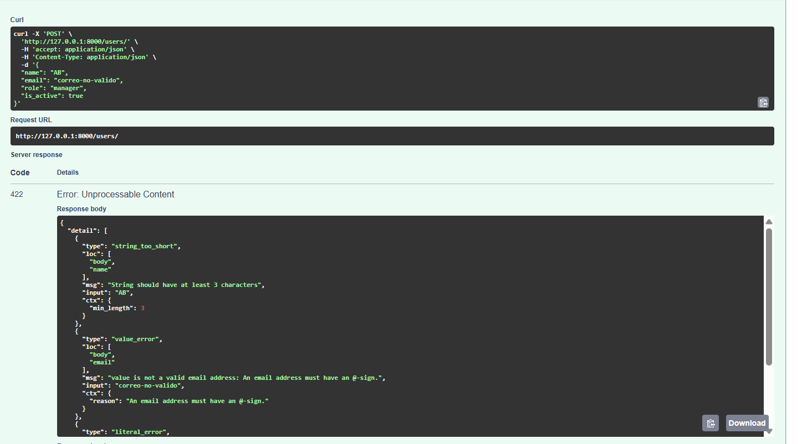

### 📸 Evidencia de errores

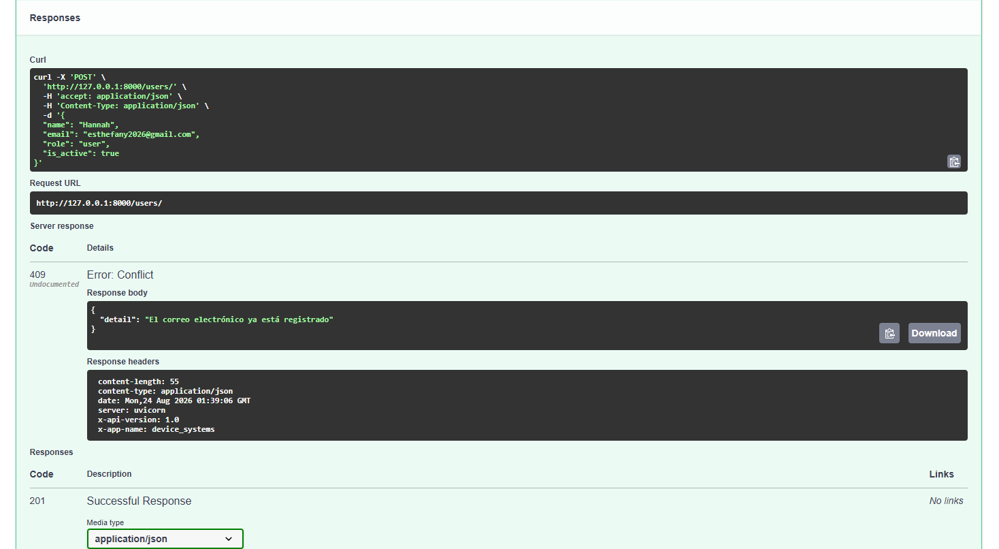

---

# 📊 Códigos de estado HTTP

La API utiliza diferentes códigos de estado dependiendo del resultado de cada operación.

| Código | Significado | Uso |
| ------ | ----------- | --- |
| 200 | OK | Consultas y actualizaciones exitosas |
| 201 | Created | Creación de usuarios |
| 204 | No Content | Eliminación exitosa |
| 400 | Bad Request | Solicitud incorrecta, como correo duplicado o PATCH vacío |
| 404 | Not Found | Usuario inexistente |
| 422 | Unprocessable Entity | Error de validación de Pydantic |

El uso de códigos de estado permite que el cliente de la API pueda identificar fácilmente el resultado de cada petición.

---

# 🔗 Dependency Injection con Depends()

Una de las principales mejoras implementadas en esta segunda actividad es el uso de **Dependency Injection** mediante `Depends()`.

Las dependencias se encuentran organizadas en:

```text
app/dependencies/user_dependencies.py
```

El objetivo de las dependencias es reutilizar lógica común entre diferentes endpoints.

Por ejemplo, una dependencia puede encargarse de buscar un usuario mediante su ID y generar automáticamente una excepción `404` cuando el usuario no existe.

Conceptualmente:

```python
def get_user_or_404(user_id: int):
    # Buscar usuario
    # Si no existe, generar HTTPException
    return user
```

Posteriormente, esta dependencia puede ser utilizada desde una ruta mediante:

```python
Depends(get_user_or_404)
```

Esto evita repetir la misma lógica en diferentes endpoints y permite mantener el código más organizado.

---

# 🧩 Separación de responsabilidades

La nueva estructura permite separar las diferentes responsabilidades de la aplicación.

```text
                    Cliente
                       │
                       ▼
                ┌─────────────┐
                │   FastAPI   │
                └──────┬──────┘
                       │
              ┌────────┴────────┐
              │                 │
              ▼                 ▼
           routes          dependencies
              │                 │
              ▼                 │
          services ◄────────────┘
              │
              ▼
             data
              │
              ▼
       users_db.py
```

Los componentes principales son:

### Routes

Reciben las peticiones HTTP y definen los endpoints.

### Schemas

Validan los datos mediante Pydantic y establecen los modelos de entrada y salida.

### Services

Contienen la lógica de negocio relacionada con las operaciones de usuarios.

### Dependencies

Contienen funciones reutilizables que pueden ser inyectadas mediante `Depends()`.

### Data

Simula una base de datos utilizando información almacenada en memoria.

Esta organización facilita el mantenimiento y permite que cada parte de la aplicación tenga una responsabilidad específica.

---

# 📋 Response Models

Los Response Models permiten definir la estructura de los datos que devuelve la API.

El modelo:

```text
UserResponse
```

establece los campos que debe contener la respuesta de un usuario.

Esto permite mantener respuestas organizadas y controlar la información que se devuelve al cliente.

---

# 📨 Cabeceras HTTP personalizadas

La API utiliza cabeceras HTTP personalizadas para identificar la aplicación y su versión.

Las cabeceras implementadas en esta segunda versión son:

```text
X-App-Name: device_systems
X-API-Version: 2.0
```

Estas cabeceras son agregadas automáticamente a las respuestas de la API.

### 📸 Evidencia

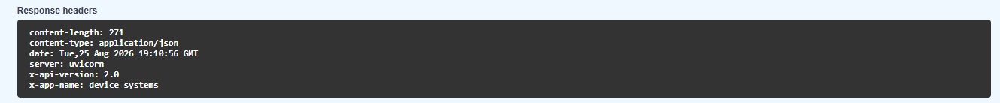

> La captura `headers.png` corresponde a la primera versión de la actividad, mientras que `headers_2.0.png` corresponde a la versión actualizada de la API.

---

# 🖥️ Documentación Swagger/OpenAPI

FastAPI genera automáticamente una documentación interactiva de la API mediante **Swagger UI**.

La documentación permite:

* Visualizar los endpoints.
* Consultar los parámetros.
* Consultar los modelos.
* Realizar peticiones.
* Revisar respuestas.
* Probar errores.
* Consultar los códigos de estado.

Para acceder a Swagger UI:

```text
http://127.0.0.1:8000/docs
```

### 📸 Evidencia de Swagger UI

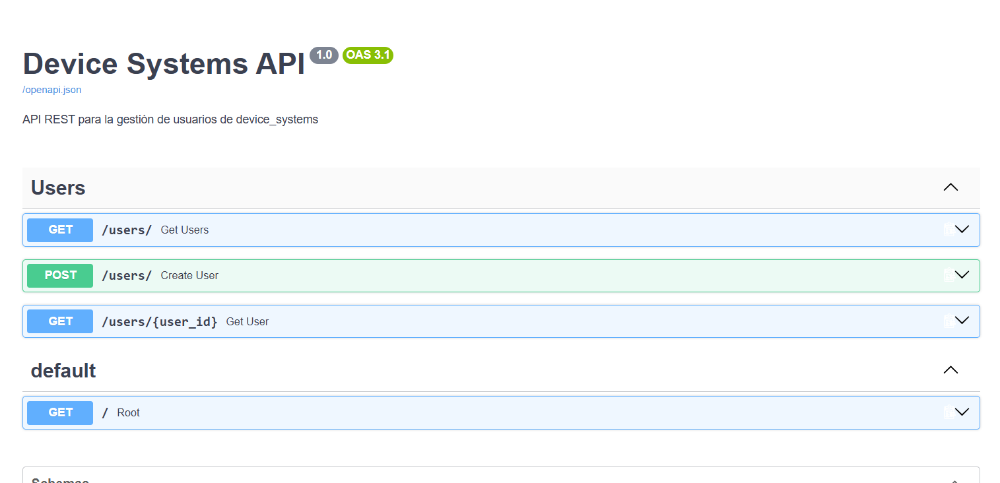

---

# 📘 ReDoc

Además de Swagger UI, FastAPI proporciona automáticamente documentación mediante **ReDoc**.

La documentación se encuentra disponible en:

```text
http://127.0.0.1:8000/redoc
```

ReDoc permite consultar de manera organizada la especificación OpenAPI de la aplicación.

### 📸 Evidencia de ReDoc

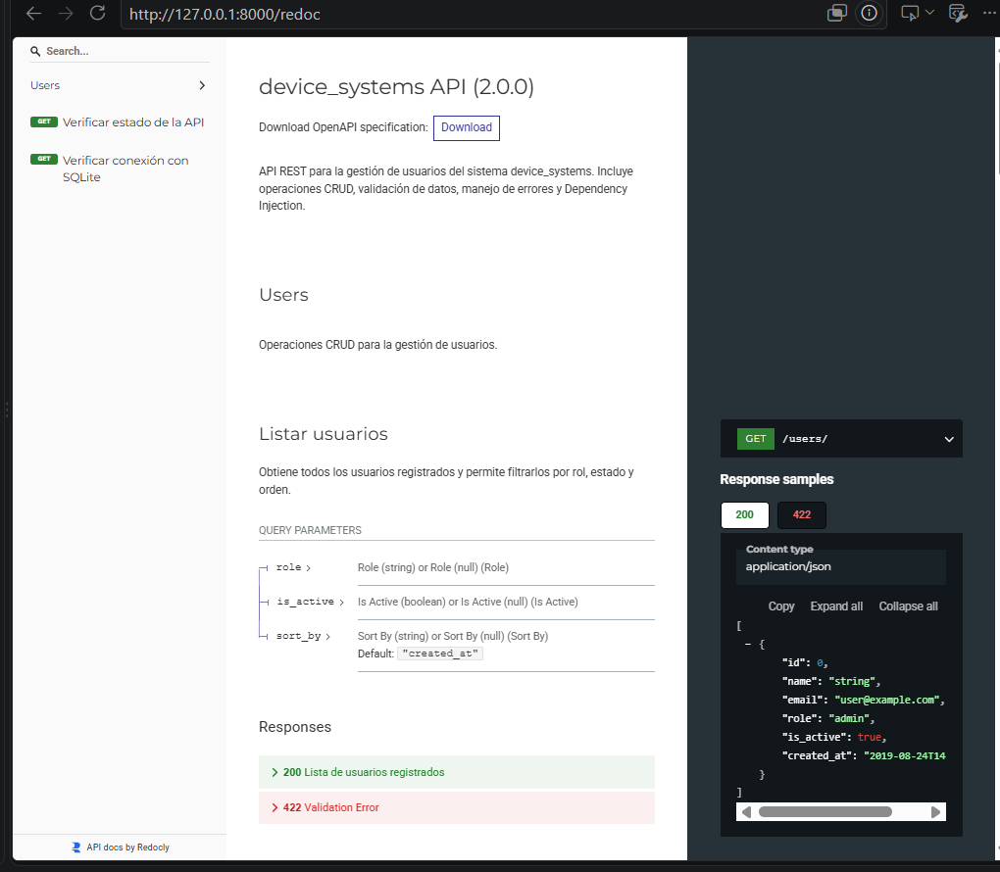

---

# ⚙️ Configuración de la API

La aplicación utiliza metadatos de FastAPI para identificar y documentar el proyecto.

Entre ellos se encuentran:

* Nombre de la API.
* Descripción.
* Versión.
* Organización mediante tags.
* Descripciones de los endpoints.
* Información de las respuestas.

La versión actual de la API es:

```text
2.0.0
```

Los endpoints relacionados con usuarios se encuentran organizados mediante el tag:

```text
Users
```

Esto permite que Swagger UI y ReDoc presenten la documentación de una manera más organizada.

---

# ▶️ Ejecución del proyecto

Para ejecutar el proyecto se debe tener Python instalado.

## 1. Crear el entorno virtual

```bash
python -m venv .venv
```

## 2. Activar el entorno virtual

En Git Bash:

```bash
source .venv/Scripts/activate
```

## 3. Instalar las dependencias

```bash
pip install -r requirements.txt
```

## 4. Ejecutar el servidor

```bash
uvicorn app.main:app --reload
```

La API estará disponible en:

```text
http://127.0.0.1:8000
```

Swagger UI:

```text
http://127.0.0.1:8000/docs
```

ReDoc:

```text
http://127.0.0.1:8000/redoc
```

---

# 📦 Tecnologías utilizadas

| Herramienta | Uso |
| ----------- | --- |
| 🐍 Python | Lenguaje utilizado para desarrollar la API |
| ⚡ FastAPI | Framework para construir la API REST |
| 🚀 Uvicorn | Servidor utilizado para ejecutar FastAPI |
| 📋 Pydantic v2 | Validación y definición de modelos |
| 📦 pip | Gestión de dependencias |
| 🌐 Swagger UI | Documentación y pruebas de la API |
| 📘 ReDoc | Documentación OpenAPI |
| 🔧 Git | Control de versiones |
| 🐙 GitHub | Repositorio del proyecto |

Las dependencias utilizadas se encuentran registradas en:

```text
requirements.txt
```

---

# 🧪 Pruebas funcionales

Durante el desarrollo de la actividad se realizaron pruebas para comprobar el funcionamiento de los diferentes endpoints.

## Operaciones exitosas

* GET `/users/`
* GET `/users/{user_id}`
* GET `/users/?role=admin`
* GET `/users/?is_active=true`
* POST `/users/`
* PUT `/users/{user_id}`
* PATCH `/users/{user_id}`
* DELETE `/users/{user_id}`

## Escenarios de error

* Usuario inexistente.
* Correo electrónico duplicado.
* Datos inválidos.
* Rol no permitido.
* PUT sobre usuario inexistente.
* PATCH vacío.
* PATCH sobre usuario inexistente.
* DELETE sobre usuario inexistente.

Las pruebas fueron realizadas principalmente mediante **Swagger UI**.

---

# 📸 Evidencias de la actividad

Las evidencias se encuentran organizadas en:

```text
docs/capturas/
```

Entre las evidencias se encuentran:

* Swagger UI.
* ReDoc.
* GET de usuarios.
* GET de usuario por ID.
* Filtros mediante Query Parameters.
* POST de usuarios.
* PUT exitoso.
* PUT con error 400.
* PUT con usuario inexistente.
* PATCH.
* PATCH con actualización de campos.
* PATCH con correo duplicado.
* PATCH con usuario inexistente.
* PATCH vacío.
* DELETE exitoso.
* DELETE de usuario inexistente.
* Cabeceras HTTP versión 2.0.
* Validaciones.
* Manejo de errores.

---

# 🔄 Evolución de la API

La segunda actividad representa una evolución de la API desarrollada inicialmente.

## Primera versión

La API inicial contaba principalmente con:

```text
GET
POST
```

Además de:

* Pydantic.
* Query Parameters.
* Path Parameters.
* Response Models.
* Cabeceras HTTP.
* Swagger UI.

## Segunda versión

La aplicación fue ampliada para implementar:

```text
GET
POST
PUT
PATCH
DELETE
```

También se incorporaron:

* Separación entre rutas, servicios, dependencias y datos.
* Dependency Injection.
* `Depends()`.
* Manejo de errores con `HTTPException`.
* Códigos de estado HTTP.
* Documentación Swagger/OpenAPI mejorada.
* ReDoc.
* Nuevas pruebas funcionales.

De esta manera, `device_systems` pasó de ser una API básica de usuarios a una API REST con operaciones CRUD completas y una estructura más organizada.

---

# 💡 Reflexión final

Durante el desarrollo de esta segunda actividad comprendí mejor cómo una API REST puede evolucionar desde una implementación básica hacia una estructura más organizada y completa.

En la primera actividad trabajé principalmente con los métodos GET y POST, los parámetros de ruta y consulta, la validación con Pydantic y los Response Models. En esta nueva etapa pude aplicar los métodos PUT, PATCH y DELETE para completar las operaciones CRUD del recurso users.

Uno de los conceptos más importantes que aprendí fue el manejo de errores mediante `HTTPException` y el uso de códigos de estado HTTP. Esto permite que la API pueda informar de manera clara al cliente cuando una operación fue exitosa o cuando ocurrió algún problema.

También fue importante aprender sobre **Dependency Injection mediante `Depends()`**, ya que permite reutilizar lógica común y evitar repetir código en diferentes rutas.

La separación del proyecto en `routes`, `schemas`, `services`, `dependencies` y `data` también permitió comprender mejor la importancia de organizar el código según las responsabilidades de cada componente.

Por otra parte, la documentación mediante Swagger UI y ReDoc facilita bastante las pruebas y permite visualizar de manera clara los endpoints, parámetros, modelos y respuestas de la API.

En general, esta actividad me permitió comprender mejor cómo construir una API REST más completa utilizando FastAPI y cómo aplicar buenas prácticas de organización, validación, manejo de errores y reutilización de código.

---

# 👩‍💻 Autora

**Esthefany Valentina Chávez Parra**

**Tecnología en Análisis y Desarrollo de Software (ADSO)**

**SENA**
