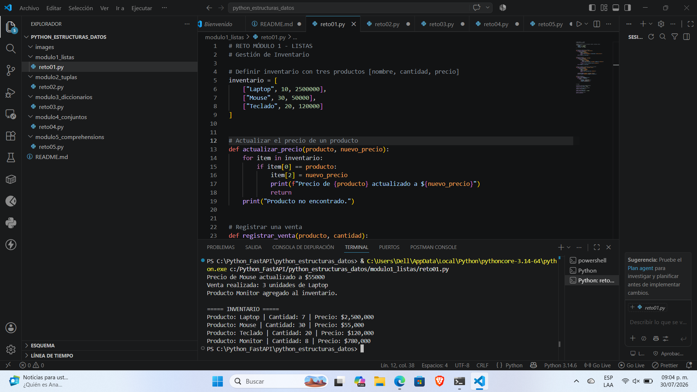
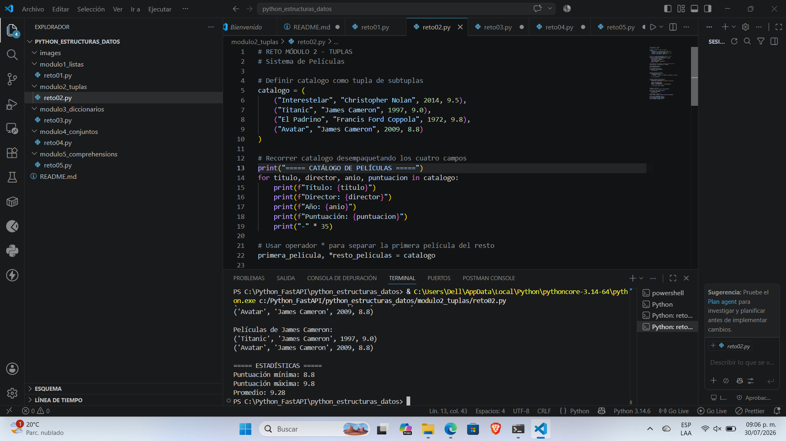
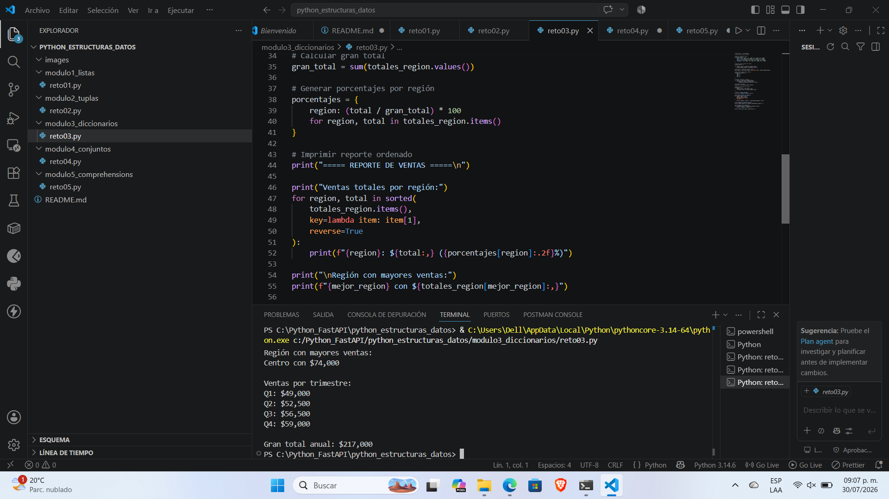
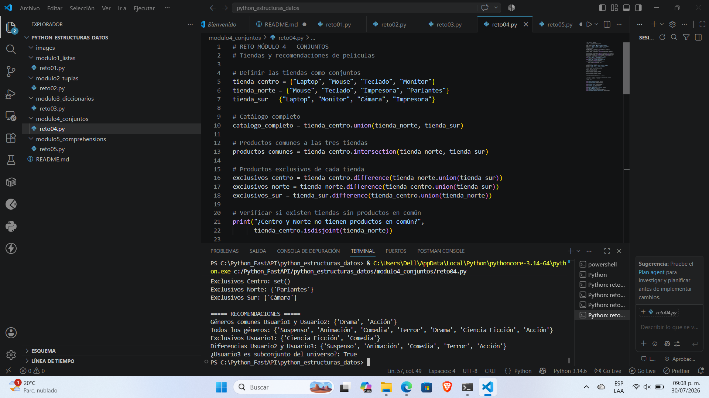
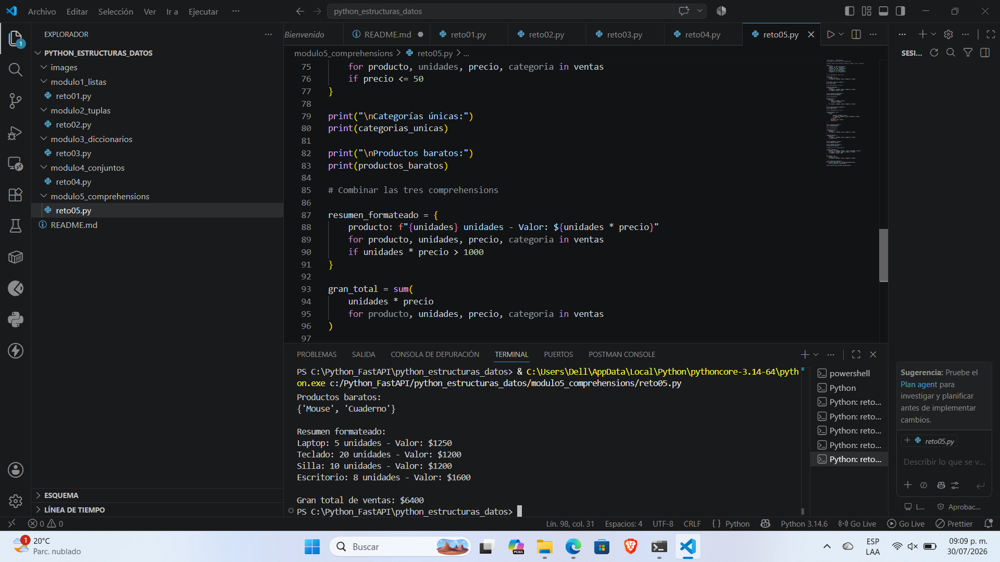

# 🐍 Estructuras de Datos en Python

Repositorio correspondiente a la actividad **Estructuras de Datos en Python**, desarrollada como parte del programa **Tecnología en Análisis y Desarrollo de Software (ADSO)** del **SENA**.

---

# 📖 Descripción

Este proyecto reúne los ejercicios y retos desarrollados durante el módulo **Estructuras de Datos en Python**.

Su objetivo es comprender el funcionamiento de las principales estructuras de datos que ofrece Python y aplicarlas mediante ejercicios prácticos y situaciones similares a problemas reales.

Durante el desarrollo del proyecto se trabajó con:

- Listas
- Tuplas
- Diccionarios
- Conjuntos
- Comprehensions

---

# 📂 Estructura del proyecto

```text
python_estructuras_datos/
│
├── images/
│   ├── comprehensions.png
│   ├── conjuntos.png
│   ├── diccionarios.png
│   ├── listas.png
│   └── tuplas.png
│
├── modulo1_listas/
│   └── reto01.py
│
├── modulo2_tuplas/
│   └── reto02.py
│
├── modulo3_diccionarios/
│   └── reto03.py
│
├── modulo4_conjuntos/
│   └── reto04.py
│
├── modulo5_comprehensions/
│   └── reto05.py
│
├── images/
│   ├── listas.png
│   ├── tuplas.png
│   ├── diccionarios.png
│   ├── conjuntos.png
│   └── comprehensions.png
│
└── README.md
```

---

# 📚 Contenido del proyecto

## 🟢 Módulo 1 - Listas

Las listas son estructuras de datos ordenadas y mutables que permiten almacenar múltiples elementos.

### Temas trabajados

- Creación de listas
- Slicing
- Métodos de listas
- Recorrido de listas
- Modificación de elementos
- Copias de listas

### Reto desarrollado

📦 Sistema de gestión de inventario utilizando listas anidadas.

---

## 🟡 Módulo 2 - Tuplas

Las tuplas permiten almacenar colecciones ordenadas cuyos elementos no pueden modificarse.

### Temas trabajados

- Inmutabilidad
- Creación de tuplas
- Acceso a elementos
- Desempaquetado
- Hashabilidad

### Reto desarrollado

🎬 Sistema de catálogo de películas.

---

## 🔵 Módulo 3 - Diccionarios

Se estudió el manejo de estructuras basadas en pares clave-valor.

### Temas trabajados

- Clave - Valor
- Operaciones CRUD
- Iteración
- Dictionary Comprehension
- Diccionarios anidados

### Reto desarrollado

📊 Análisis de ventas por región.

---

## 🟣 Módulo 4 - Conjuntos

Los conjuntos permiten trabajar con elementos únicos y operaciones de teoría de conjuntos.

### Temas trabajados

- Unicidad
- Operaciones entre conjuntos
- Métodos
- Operadores
- `isdisjoint()`

### Reto desarrollado

🎥 Análisis de catálogos de tiendas y recomendaciones de películas.

---

## 🔴 Módulo 5 - Comprehensions

Las comprehensions permiten construir colecciones de manera más eficiente y con un código más limpio.

### Temas trabajados

- List Comprehension
- Dict Comprehension
- Set Comprehension
- Filtros
- Optimización del código

### Reto desarrollado

📈 Analizador de ventas utilizando List, Dict y Set Comprehensions.

---

# 🎯 Retos desarrollados

- 📦 Gestión de inventario
- 🎬 Sistema de catálogo de películas
- 📊 Análisis de ventas por región
- 🎥 Catálogos de tiendas y recomendaciones
- 📈 Analizador de ventas mediante Comprehensions

---

# 🖼️ Evidencias de ejecución

## 🟢 Módulo 1 - Listas



---

## 🟡 Módulo 2 - Tuplas



---

## 🔵 Módulo 3 - Diccionarios



---

## 🟣 Módulo 4 - Conjuntos



---

## 🔴 Módulo 5 - Comprehensions



---

# 🚀 Requisitos

- Python 3.x
- Visual Studio Code (o cualquier editor compatible)
- Git
- GitHub

---

# ▶️ Cómo ejecutar los ejercicios

Cada reto puede ejecutarse desde la carpeta principal del proyecto.

Ejemplo:

```bash
py modulo1_listas/reto01.py
```

También puedes utilizar:

```bash
python modulo1_listas/reto01.py
```

Repitiendo la misma estructura para los demás módulos.

---

# 🛠️ Tecnologías utilizadas

| Herramienta | Uso |
|-------------|-----|
| 🐍 Python 3 | Desarrollo de los ejercicios |
| Git | Control de versiones |
| GitHub | Repositorio remoto |
| Visual Studio Code | Editor de código |

---

# 🎯 Objetivo del proyecto

Aplicar las principales estructuras de datos de Python mediante ejercicios prácticos que permitan fortalecer la lógica de programación y desarrollar soluciones organizadas, eficientes y fáciles de mantener.

---

# 💡 Reflexión

Durante el desarrollo de esta actividad reforcé mis conocimientos sobre las estructuras de datos más importantes de Python y comprendí en qué situaciones resulta más adecuado utilizar listas, tuplas, diccionarios o conjuntos según las necesidades del problema.

Además, aprendí a utilizar las comprehensions para escribir código más limpio, corto y eficiente, mejorando tanto la organización como la legibilidad de los programas.

Los retos propuestos me permitieron aplicar estos conceptos en escenarios similares a casos reales, fortaleciendo mi lógica de programación y mi capacidad para diseñar soluciones más estructuradas.

---

# ✅ Conclusión

Este proyecto permitió consolidar los conocimientos adquiridos sobre estructuras de datos en Python mediante ejercicios prácticos y retos de programación, fortaleciendo las habilidades necesarias para desarrollar soluciones organizadas, eficientes y fáciles de mantener.

---

# 👩‍💻 Autor

**Esthefany Valentina Chávez Parra**

**Tecnología en Análisis y Desarrollo de Software (ADSO)**

**SENA**